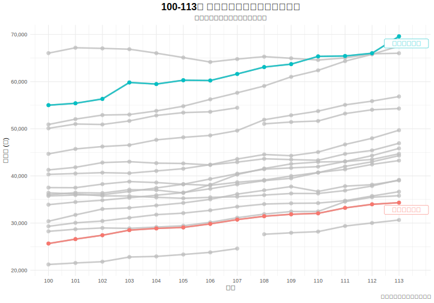
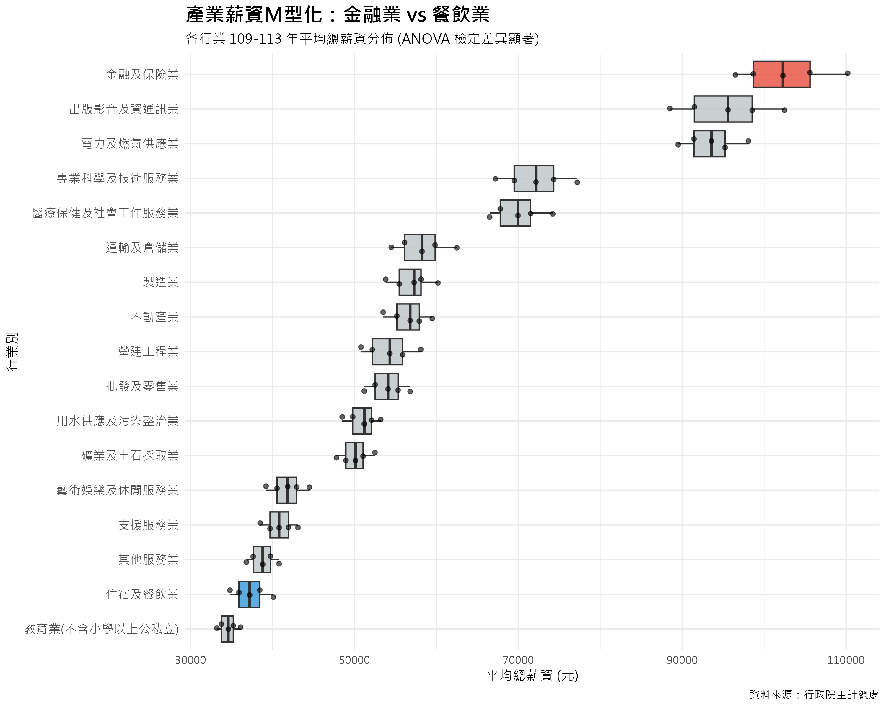
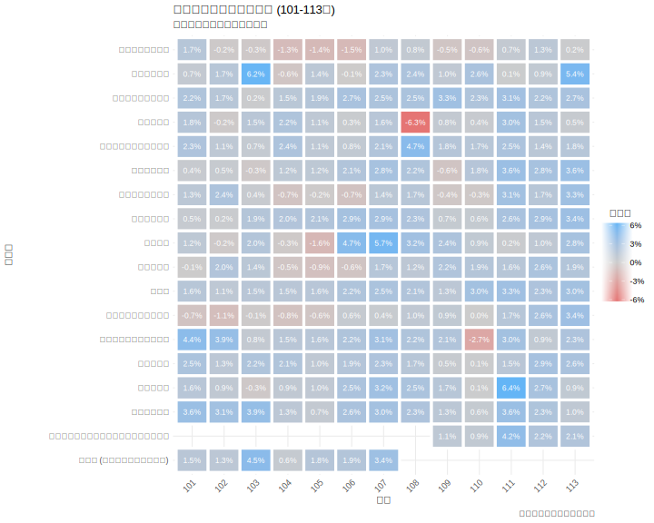

# 3.2 產業現實：檢視薪資結構差異

在深入分析薪資與學生選擇的關聯之前，必須先確立「薪資」本身作為一個有效市場區隔變數的地位。本節旨在透過視覺化圖表與嚴謹的統計檢定，證明不同行業別之間的總薪資確實存在顯著差異。

---

### 3.2.1 薪資水平與成長趨勢視覺化

圖 3.2.1 呈現了 100 至 113 年間各主要行業的平均總薪資趨勢。為進一步檢視各行業薪資的穩定性與分佈區間，我們繪製了盒鬚圖（圖 3.2.2）。

_圖 3.2.1：100-113 年各主要行業別平均總薪資趨勢_

_圖 3.2.2：各行業平均總薪資盒鬚圖 (100-113 年)。盒身代表薪資的中位數與四分位距，顯示了該行業在十四年內的薪資波動範圍。_

從圖 3.2.1 可見，行業間的薪資水平存在顯著且穩固的差異。圖 3.2.2 則進一步揭示了極端的薪資斷層：**金融及保險業**作為高薪代表，其平均薪資突破 **6 萬元**大關，且分佈區間較寬，顯示內部成長動能強勁；相對地，**住宿及餐飲業**則長期滯留於低薪區間，分佈極為狹窄，顯示其薪資結構高度僵固。

圖 3.2.3 則以熱力圖形式視覺化了各行業在 101 至 113 年間的薪資年增率。

_圖 3.2.3：101-113 年各行業薪資年增率熱力圖_

圖 3.2.3 補充說明，多數行業在多數年度都實現了正向的薪資增長，但增長幅度各異，這為後續分析提供了動態的「潛力」視角。

### 3.2.2 單因子變異數分析 (ANOVA)

為驗證上述視覺化觀察是否具有統計顯著性，本節採用**單因子變異數分析 (One-way ANOVA)**。

- **研究假說**:
  - **虛無假設 $H_0$**: 所有行業別的平均總薪資皆相等 ($\mu_1 = \mu_2 = \dots = \mu_k$)。
  - **對立假設 $H_1$**: 至少有兩個行業別的平均總薪資不相等。

在執行分析前，我們檢視了數據的常態性與變異數同質性。雖然圖 3.2.2 顯示不同行業間的薪資變異數可能存在差異（高薪行業波動較大），但考量到本研究樣本數充足（N=238），且 ANOVA 對於常態性與同質性假設的違反具有相當的穩健性（Robustness），因此仍採用單因子變異數分析來檢定均值差異。

**表 3.2.1：總薪資之變異數分析 (ANOVA) 摘要表**

| 變異來源 | 平方和 (SS) | df  | 均方 (MS)  |   F    |    顯著性    |
| :------- | :---------: | :-: | :--------: | :----: | :----------: |
| 群組之間 | 2.9394e+10  | 18  | 1632974892 | 191.77 | < .001\*\*\* |
| 組內     | 1.8648e+09  | 219 |  8515122   |        |              |
| **總計** | 3.1259e+10  | 237 |            |        |              |

ANOVA 的 F 檢定統計量為 **191.77**，達到極顯著水準 (p < .001)。此結果強烈地**拒絕了虛無假設**，證明不同行業別之間的平均總薪資確實存在統計上的顯著差異。

### 3.2.3 關鍵差異檢定：高薪區與低薪區的對決

綜合描述性統計與事後檢定 (Tukey HSD) 的結果，台灣的產業薪資結構並非均勻分佈，而是呈現出劇烈的斷層。我們特別聚焦於兩個極端群體進行比較 (詳細數據請參閱**附錄 A** 及**附錄 D**)：

1.  **高薪區 (High Salary Zone)**：以 **金融及保險業** 為首，平均薪資高達 **61,530 元**。此類產業不僅起薪高，且隨著年資增長的幅度顯著，構成了就業市場的「頂層階梯」。
2.  **重災區 (Disaster Zone)**：以 **住宿及餐飲業** 為代表，平均薪資僅 **30,259 元**。此類產業長期處於基本工資邊緣，且薪資天花板極低，形成了難以跨越的「底層陷阱」。

表 3.2.2 顯示了這兩個極端產業的 Tukey HSD 事後比較結果。

**表 3.2.2：金融及保險業 vs 住宿及餐飲業 Tukey HSD 檢定結果**

| (I) 行業別   | (J) 行業別   | 平均值差異 (I-J) | 顯著性 | 95% CI 下界 | 95% CI 上界 |
| :----------- | :----------- | ---------------: | :----: | ----------: | ----------: |
| 金融及保險業 | 住宿及餐飲業 |        31,271.21 | <.001  |   27,344.37 |   35,198.06 |

_註：顯著性 <.001 代表極顯著。_

檢定結果顯示，兩者之間存在高達 **31,271 元** 的平均月薪差異，且此差異在統計上達到極顯著水準 (p < .001)。這證明金融業從業人員的平均月薪顯著高於餐飲業，產業間薪資斷層明顯。

此一巨大的薪資鴻溝，不僅是統計上的顯著差異，更是驅動學生選系行為的強大經濟誘因。當「選錯行」意味著收入可能縮水近**一半**時，學生在升學階段的「趨吉避凶」便成為了理性的經濟決策。

### 3.2.4 小結

本節透過視覺化及統計檢定，證實了勞動市場上存在顯著且穩固的**行業薪資壁壘**。此發現為本研究的核心假說——學生選擇可能受「經濟理性」驅動——提供了關鍵的立論基礎。
