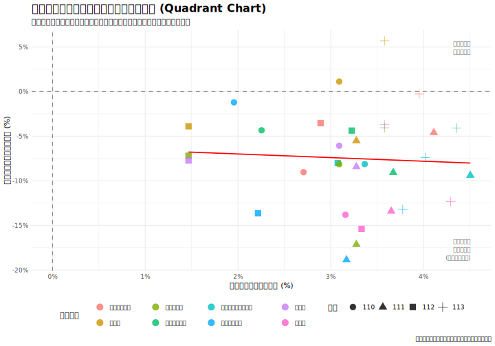

# 3.3 關鍵決策矩陣：比較薪資與報名人數的年度增長率

在分別確立了「少子化推力」與「產業薪資差異」後，本節旨在透過一個更動態的視覺化圖表，探討「行業薪資的年度變化」與「科系報名人數的年度變化」是否存在同步關係，以更細緻地驗證本研究的核心假說。

---

### 3.3.1 分析方法

我們繪製一個以年度增長率為基礎的二維散佈圖。圖表的中心點為 (0, 0)，代表薪資與人數均無變動的基準。圖中的虛線是透過**普通最小二乘法 (Ordinary Least Squares, OLS)** 繪製的線性迴歸線，用於視覺化兩個變數間的平均線性趨勢。

- **繪圖變數**:

  - **X 軸**: **行業薪資年增率** (`薪資年增率`)。代表該行業當年度的「經濟吸引力變化」。
  - **Y 軸**: **科系報名人數年增率** (`報名人數年增率`)。代表該科系當年度的「學生選擇趨勢變化」。

- **趨勢線公式**:
  $$
  Y = \beta_0 + \beta_1 X
  $$
  其中 $Y$ 為「報名人數年增率」，$X$ 為「薪資年增率」。這條趨勢線的斜率 ($\beta_1$) 直觀地呈現了兩者間的關係方向。

圖中的每一個點，都代表一個「統測群類」在**特定年份**的表現（例如「餐旅群」在 110 年的數據點）。我們預期，如果學生的選擇是經濟理性的，那麼薪資增長較快的科系，其報名人數的衰退應該會較為和緩，亦即趨勢線斜率為正。

### 3.3.2 圖表分析與討論

_圖 3.3.1：行業薪資與群類人數變動率散佈圖 (Quadrant Chart)。圖中虛線將平面劃分為四個象限，絕大多數資料點落於第四象限（右下角）。_

**結果判讀：**
如圖 3.3.1 所示，散佈圖中的資料點提供了一個比之前更為複雜但深刻的視角。

1.  **普遍的負成長 (第四象限主導)**：
    透過象限圖的劃分，我們可以清晰地看到，絕大多數的資料點都落在 **第四象限 (X 軸 > 0, Y 軸 < 0)**。這代表了一個殘酷的現實：即便大多數行業的薪資都在成長（X 軸為正），對應科系的報名人數卻仍在衰退（Y 軸為負）。這直觀地證實了少子化的「推力」遠大於薪資增長的「拉力」。

2.  **趨勢線的初步觀察**：圖中的紅色虛線（迴歸趨勢線）呈現出一個**非常平緩的負斜率**，幾乎趨近於零。這與純粹的視覺判斷可能會引導出的「正向關聯」印象有所不同。儘管視覺上資料點可能看似朝某一方向分佈，但客觀擬合的線性趨勢線，其斜率並不顯著偏離水平。這表明，**單純依靠視覺判斷可能具有誤導性**，需要透過更嚴謹的統計檢定來確認「薪資年增率」與「報名人數年增率」之間是否存在統計上顯著的線性關係。

3.  **群類表現分化顯著**：

    - **重災區 vs. 抗跌區**：我們可以清楚地比較不同群類在此的相對位置。例如，**`餐旅群`** 的所有年度資料點，其 Y 值都落在 -12% 以下，是衰退最嚴重的群體之一。與之相對，**`電機與電子群資電類`** 的資料點，雖然 Y 值也為負，但普遍分佈在 -7% 至 -9% 的區間，其衰退幅度顯著小於餐旅群。這直觀地呈現了，雖然同在「薪資成長、人數衰退」的困境中，但薪資待遇與成長預期更好的科系，確實展現了更強的「抗跌」能力。
    - **衛生與護理類**：此群類展現了較為複雜的動態。雖然多數年度的報名人數亦呈現負成長，但其幅度相較於餐旅群通常較為緩和。特別是在 110 年，該群類的報名人數年增率僅為 -1.21%，幾乎趨於穩定，顯示其在特定時期具有較強的韌性。然而，在 111 年則出現了較大的跌幅 (-18.9%)，這提示我們除了薪資成長外，可能還有其他特定年度的政策、社會事件或職業形象變化等因素，對其招生有顯著影響。

4.  **「製造業」的內部分歧與模型局限**：
    - 本研究將「機械群」、「動力機械群」、「化工群」都對應到泛稱的「製造業」，並採用相同的薪資數據。然而，在圖上我們可能會觀察到這三個群類的資料點並未完全重合，甚至表現出不同的衰退幅度。
    - 這一現象揭示了本研究的一個**局限性**：使用大類別的行業薪資，可能無法完全捕捉特定次產業領域（如精密機械 vs. 傳統製造、半導體化工 vs. 傳統化工）的人才供需狀況。這也暗示了，除了廣泛的產業薪資外，特定領域的技術門檻、工作前景、甚至新聞熱度，都可能是影響學生選擇的潛在因素。

### 3.3.3 小結：薪資無法逆轉趨勢，但能提供「抗跌」保護

本節的年增率分析揭示了一個比單純「正相關」更為深刻的現象：

1.  **大趨勢不可逆**：少子化的結構性衝擊（Y 軸普遍下降）遠大於短期薪資調整的拉力，導致幾乎所有科系都呈現負成長。單純的薪資增長（X 軸的移動）不足以抵銷人口紅利的消失。
2.  **薪資的防禦性功能**：雖然無法創造正成長，但我們觀察到顯著的「抗跌」現象。高薪群類（如資電群）的衰退幅度（約 -7% 至 -9%）顯著小於低薪群類（如餐旅群，跌幅超過 -12%）。

這暗示了**薪資在少子化時代的角色，已從「驅動成長的引擎」轉變為「減緩衰退的護城河」**。學生並非不看薪資，而是在人口退潮時，優先保留了高回報的選項，放棄了低回報的選項。為了確認此視覺觀察是否具有統計顯著性，下一節將使用更嚴謹的迴歸模型進行量化驗證。
