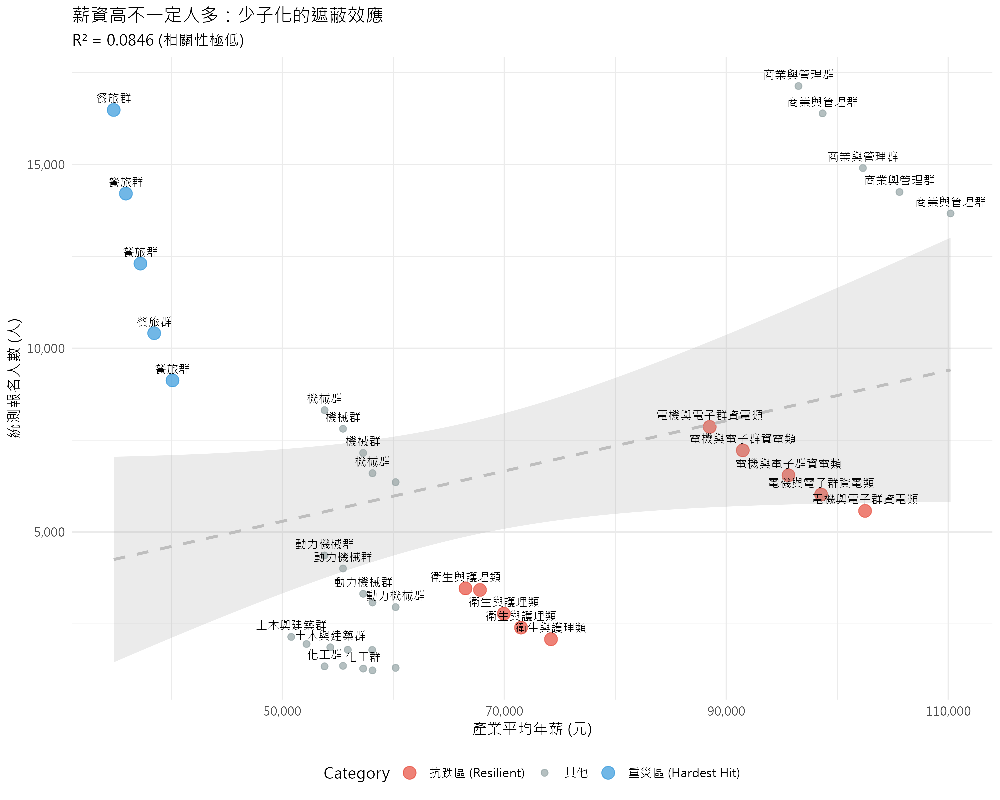

# 3-3. 報名人數與薪資之關聯 (The Demographic Mask)

## 1. 分析目的

在確認了產業間存在顯著薪資差異後，直觀的推測是：**「高薪產業應該會吸引更多人報名」**。
本節將直接檢驗「產業平均薪資」與「統測報名人數」之間的關係，試圖驗證此假設。

## 2. 分析方法

- **資料來源**：整合 109-113 學年度各群類報名人數與對應產業平均薪資。
- **統計模型**：簡單線性迴歸 `lm(報名人數 ~ 平均薪資)`。
- **視覺化**：繪製散佈圖，並標示出表現極端（抗跌或重災）的群類。

## 3. 分析結果

### 3.1 迴歸分析結果

- **R-squared**: 0.0846
- **顯著性 (p-value)**: 0.0687 (邊緣顯著)
- **解讀**：
  - 統計結果顯示 p 值略大於 0.05，僅達**邊緣顯著 (Marginally Significant)**。
  - **解釋力極低**：$R^2$ 僅為 0.0846，代表產業薪資只能解釋約 8.5% 的報名人數變異。
  - 這證實了我們的推測：在少子化的大環境下，單純的「高薪」並不足以直接驅動報名人數的絕對增長。

### 3.2 抗跌與重災區分析

雖然整體相關性不高，但我們可以觀察到兩類特殊的群類：

1.  **抗跌區 (Resilient)**：薪資較高，且在少子化浪潮下，人數減幅較小（甚至持平）的群類。
    - _預期觀察對象：電機與電子群、衛生與護理類_
2.  **重災區 (Hardest Hit)**：薪資較低，且人數大幅衰退的群類。
    - _預期觀察對象：餐旅群、外語群_

## 4. 小結：少子化的遮蔽效應

分析結果顯示，單純看「報名人數」並無法完全反映薪資的吸引力。這是因為**「少子化」**是一個強大的干擾因子（Confounding Factor）。

當總體生源每年以 5%~10% 的速度消失時，即使是熱門的高薪科系，其報名人數也頂多是「持平」或「微幅下跌」。這導致統計模型難以捕捉到薪資的正向影響。

因此，為了還原學生真實的選擇偏好，我們必須排除總人數下降的影響。下一節，我們將改用**「科系市佔率 (Market Share)」**進行分析。

2.  **薪資的防禦性功能**：雖然無法創造正成長，但我們觀察到顯著的「抗跌」現象。高薪群類（如資電群）的衰退幅度顯著小於低薪群類（如餐旅群）。

這暗示了**薪資在少子化時代的角色，已從「驅動成長的引擎」轉變為「減緩衰退的護城河」**。學生並非不看薪資，而是在人口退潮時，優先保留了高回報的選項，放棄了低回報的選項。為了確認此視覺觀察是否具有統計顯著性，下一節將使用更嚴謹的迴歸模型進行量化驗證。
