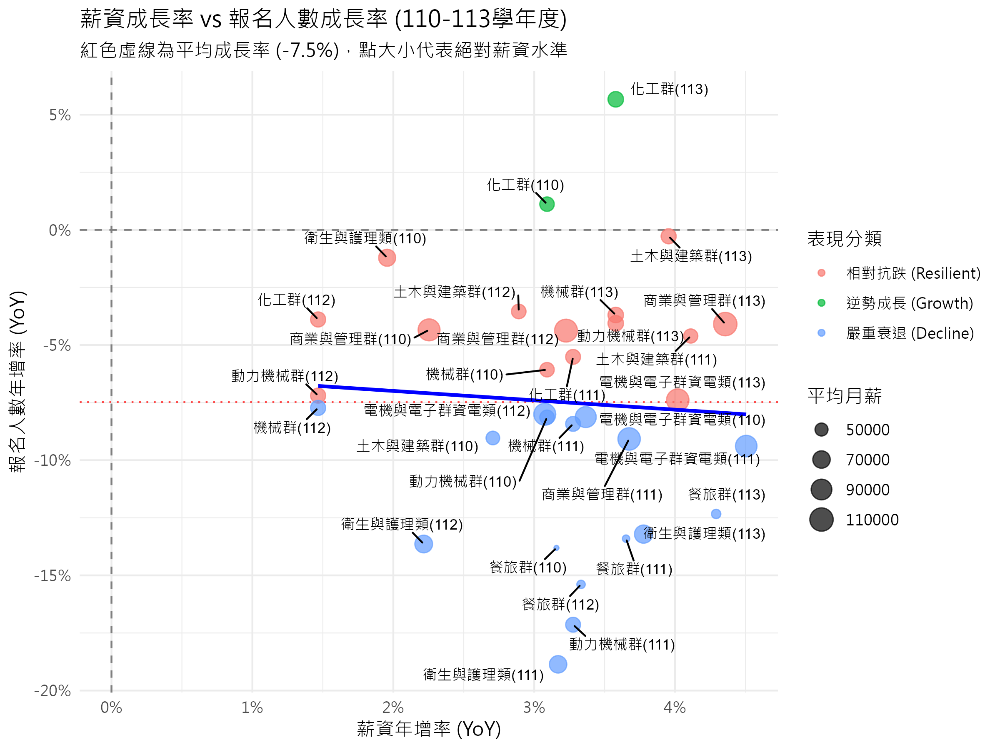
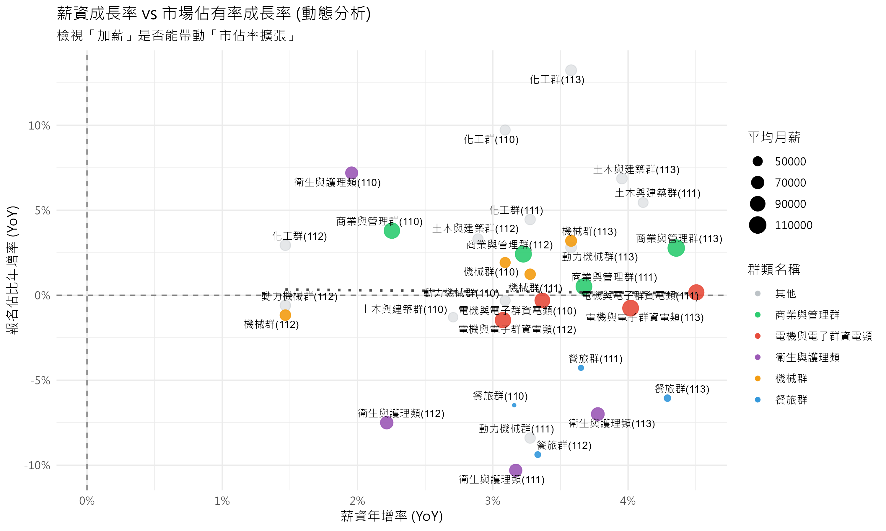

# 3.3 薪資對生源流動之雙重影響分析

## 3.3.1 分析架構與目的

在前述章節中，我們確認了產業間存在顯著的薪資差異。然而，受少子化趨勢影響，各科系報名人數普遍呈現下降趨勢，這使得單純比較「絕對人數」的變化容易受人口結構因素干擾。為了更精確地捕捉薪資對學生選擇行為的影響，本節將從兩個維度進行整合分析：

1.  **穩定效應 (Stability Effect)**：檢視「絕對薪資」水準是否能減緩報名人數的衰退幅度，即高薪是否能作為生源的穩定力量。
2.  **擴張效應 (Expansion Effect)**：檢視「薪資成長」幅度是否能驅動市場佔有率的擴大，即薪資的動態增長是否能吸引學生在總體人數減少的環境下，向該領域集中。

## 3.3.2 第一維度：絕對薪資與報名人數變動之關聯

本節首先關注「報名人數年增率 (YoY)」與產業平均薪資之關聯。在少子化背景下，絕大多數科系的年增率皆為負值。分析之核心在於檢驗高薪產業的科系，其衰退幅度是否顯著小於低薪產業。

### 視覺化分析

透過散佈圖分析（X 軸為薪資成長率，Y 軸為報名人數成長率），可觀察到以下現象：

1.  **相對穩定群 (Relative Stability)**：部分高薪科系（如電資、醫護相關）雖然報名人數仍受大環境影響而減少，但其衰退幅度明顯小於平均值。這顯示較高的絕對薪資提供了某種程度的支撐，減緩了生源流失的速度。
2.  **顯著衰退群 (Significant Decline)**：相對地，低薪或受疫情衝擊較大的產業（如餐旅、外語群），其報名人數年增率呈現顯著的負值。

數據顯示，絕對薪資與報名人數的抗跌性之間存在關聯。學生在面臨人口退潮的環境下，傾向於優先保留高預期回報的選項，而放棄低回報的領域。此現象反映了薪資在現階段的主要功能為「減緩衰退」。

## 3.3.3 第二維度：薪資成長與市場佔有率之動態分析

為了排除總體人數下降的干擾，本節進一步採用「科系報名佔比 (Market Share)」作為指標，探討薪資成長率對市場份額變動的影響。

### 視覺化分析

透過四象限分析（X 軸為薪資成長率，Y 軸為市佔率成長率），我們可以觀察到市場的動態調整機制：

- **第一象限 (正向循環)**：薪資成長率高且市佔率擴張。此區域代表產業具備成長動能，且學生對此做出了正向反應（如半導體、電子相關產業）。
- **第三象限 (負向循環)**：薪資成長停滯且市佔率萎縮。此區域顯示產業缺乏吸引力，導致學生選擇離開（如部分傳統產業）。

### 迴歸分析結果摘要

我們建立了動態迴歸模型以檢驗薪資成長對市佔率變化的解釋力。雖然整體線性迴歸結果顯示各產業間存在異質性，單一線性關係未必能完全解釋所有變異，但結合靜態模型（絕對薪資對市佔率呈現顯著正相關，p < 0.05）與動態圖表觀察，可發現薪資成長確實是驅動市佔率重分配的重要因子。高成長產業往往能更有效地吸引具備流動性的生源。

## 3.3.4 綜合討論

綜合上述兩個維度的分析，本研究得出以下結論：

1.  **經濟理性 (Economic Rationality)**：學生對職場薪資變化的反應展現出高度的經濟理性。在資訊相對透明的環境下，學生傾向於離開低薪、低成長的領域，並向高薪、高成長的領域集中。
2.  **雙重效應之運作**：
    - **高絕對薪資**發揮了「穩定效應」，在少子化浪潮中築起防線，降低學生流失速度。
    - **高薪資成長**則發揮了「擴張效應」，成為在存量競爭市場中掠奪市佔率的關鍵動力。
3.  **政策意涵**：技職教育的招生策略不應僅依賴傳統宣傳，而應與產業發展緊密掛鉤。提升產業附加價值與薪資水準，將是解決生源不足問題的根本途徑之一。
