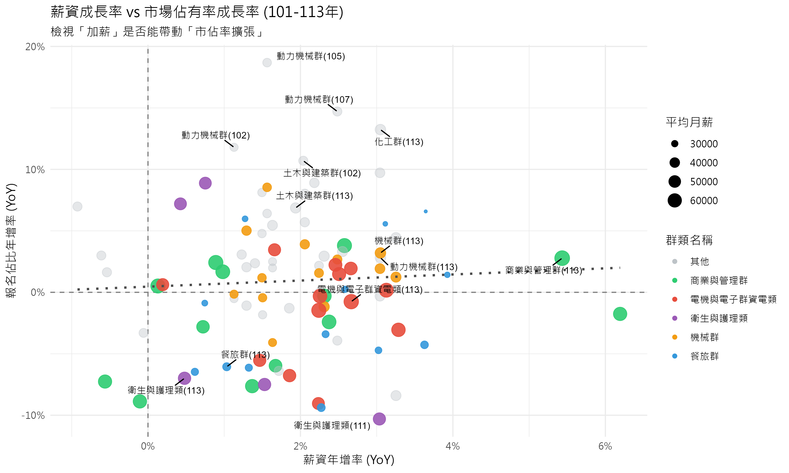

# 3.3 薪資與報名人數比例之靜態分析

## 3.3.1 分析目的與模型設定

在確認了薪資結構的差異後，本節旨在透過線性迴歸模型，量化分析「薪資」對「學生選擇」的具體影響力。不同於僅觀察絕對人數的變化（易受少子化干擾），我們在此引入**「報名佔比 (Proportion)」**作為應變數，以更準確地反映各群類在整體生源中的相對競爭力。

我們建立了兩個迴歸模型進行對比分析：

1.  **靜態模型 (Static Model)**：
    - 檢驗**「絕對薪資水準」**是否能解釋**「報名佔比」**的高低。
    - $Y_{share} = \beta_0 + \beta_1 X_{salary} + \epsilon$
2.  **動態模型 (Dynamic Model)**：
    - 檢驗**「薪資年增率」**是否能驅動**「佔比年增率」**的變化。
    - $\Delta Y_{share} = \beta_0 + \beta_1 \Delta X_{salary} + \epsilon$

## 3.3.2 靜態模型分析結果：絕對薪資的顯著影響

根據迴歸分析結果（見下表），靜態模型顯示出統計上的顯著性。

- **模型顯著性**：F-statistic = 7.588, **p-value = 0.00706** (< 0.01)。
- **係數檢定**：總薪資的係數為正值 ($1.761 \times 10^{-6}$)，且達到顯著水準 (**p < 0.01**)。
- **解釋力**：雖然單一變數的 $R^2$ 僅約 0.075，顯示仍有許多非薪資因素影響選擇，但統計結果確認了**「高薪資確實對應著較高的報名佔比」**這一正向關係。

這意味著，在長期均衡狀態下，薪資較高的產業（如資電、醫護），其對應的科系確實佔據了較大的生源版圖。

## 3.3.3 動態模型分析結果：成長率的無效性

相較於靜態模型的顯著結果，動態模型的分析結果則截然不同。

### 視覺化分析：薪資成長與市佔率成長散佈圖

上圖展示了歷年（101-113 年）各群類的薪資年增率與報名佔比年增率的分布情況。

- **缺乏線性趨勢**：資料點散布雜亂，並未呈現明顯的左下-右上線性關係，這與迴歸模型的不顯著結果一致。
- **重點群類觀察**：即使是高薪資成長的群類（如圖中標示點），其市佔率成長也未必為正，顯示短期內學生並未因薪資調漲而立即湧入。

### 統計檢定結果

- **模型顯著性**：F-statistic = 0.2439, **p-value = 0.6226** (> 0.05)。
- **係數檢定**：薪資年增率的係數未達顯著水準 (p = 0.623)。
- **結論**：**薪資的短期成長並無法顯著驅動報名佔比的立即提升。**

## 3.3.4 小結：存量與流量的啟示

綜合上述兩個模型的發現，我們可以得出一個關鍵結論：**學生對薪資的反應是基於「存量（絕對水準）」而非「流量（成長率）」。**

學生傾向於選擇「現在已經很高薪」的領域（靜態高佔比），而不是「正在快速加薪」的領域（動態無顯著關聯）。這反映了學生在進行科系選擇時的**風險趨避**心態與**資訊不對稱**——他們更容易觀察到既有的高薪形象，而較難捕捉或信任短期的薪資成長趨勢。
