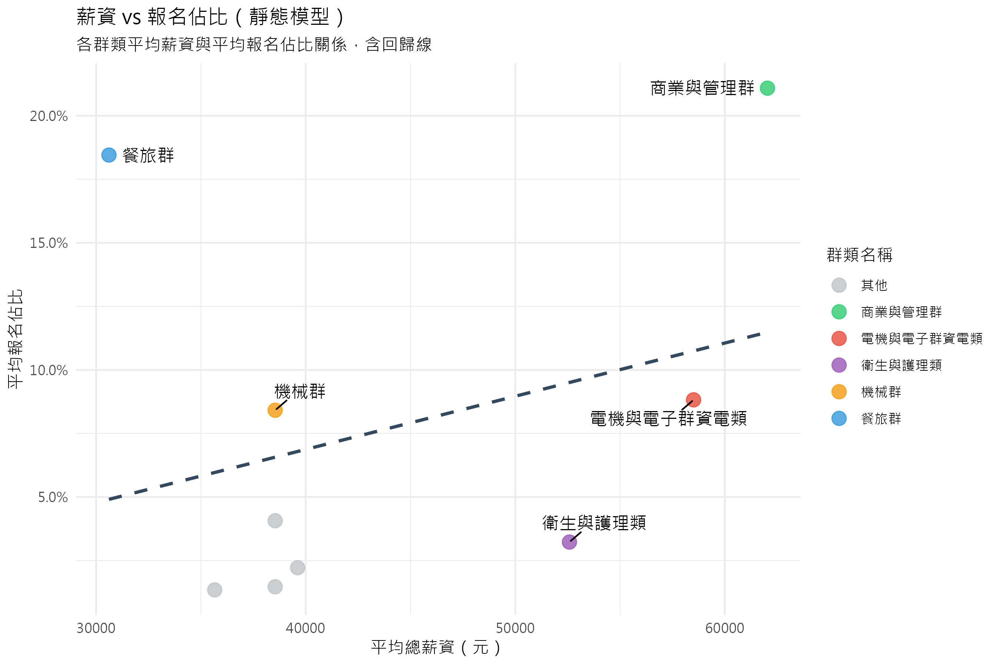

# 3.3 市場佔有率分析：薪資存量效應

## 3.3.1 分析目的與模型設定

在確認了薪資結構的差異後，本節旨在透過線性迴歸模型，量化分析「薪資」對「學生選擇」的具體影響力。不同於僅觀察絕對人數的變化（易受少子化干擾），我們在此引入**「報名佔比 (Proportion)」**作為應變數，以更準確地反映各群類在整體生源中的相對競爭力。

我們建立了兩個迴歸模型進行對比分析（本節聚焦於靜態模型）：

1.  **靜態模型 (Static Model) - 存量效應**：
    - 檢驗**「絕對薪資水準 (Stock)」**是否能解釋**「報名佔比」**的高低。
    - $Y_{share} = \beta_0 + \beta_1 X_{salary} + \epsilon$
2.  **動態模型 (Dynamic Model)**：
    - 檢驗**「薪資年增率」**是否能驅動**「佔比年增率」**的變化。
    - $\Delta Y_{share} = \beta_0 + \beta_1 \Delta X_{salary} + \epsilon$

## 3.3.2 靜態模型分析結果：顯著趨勢與結構性例外

### 視覺化分析：長期平均薪資與市佔率關係

上圖展示了各群類「平均薪資」與「平均報名佔比」的關係。

- **正向趨勢**：從圖中回歸線（虛線）可見，整體呈現左下至右上的正向趨勢，顯示薪資水準較高的群類，通常也擁有較高的學生報名佔比。
- **群類分布**：
  - **高薪高佔比**：如「電機與電子群資電類」、「衛生與護理類」與「商業與管理群」，位於圖表右上方，符合高薪吸引人才的預期。
  - **低薪高佔比**：值得注意的是「餐旅群」，雖然平均薪資相對較低，但仍擁有極高的報名佔比，顯示該領域可能存在非金錢的吸引力（如入門門檻、興趣導向等），這也是模型 $R^2$ 較低的原因之一。

### 統計檢定結果：顯著但有限的解釋力

根據迴歸分析結果（見下表），靜態模型顯示出統計上的顯著性，但其解釋力受到結構性因素的限制。

- **模型顯著性**：F-statistic = 7.588, **p-value = 0.00706** (< 0.01)。
- **係數檢定**：總薪資的係數為正值 ($1.761 \times 10^{-6}$)，且達到顯著水準 (**p < 0.01**)。
- **解釋力 ($R^2$)**：模型的 $R^2$ 僅約 **0.075**。這意味著，雖然薪資與報名佔比之間存在顯著的正向關聯，但「絕對薪資」僅能解釋約 **7.5%** 的學生選擇變異。

### 深入解析：雙軌制的市場結構

低 $R^2$ 的主因來自於市場中存在的**「結構性離群值 (Structural Outliers)」**，這顯示學生選擇並非單純的線性經濟決策，而是呈現「雙軌制」：

1.  **理性經濟群 (Rational Economic Group)**：

    - 代表群類：**電機與電子群資電類、衛生與護理類、商業與管理群**。
    - 特徵：高薪資對應高報名佔比，完全符合模型的預測。學生對這些領域的投入，明確反映了對未來高回報的追求。

2.  **非經濟導向群 (Non-Economic Oriented Group)**：
    - 代表群類：**餐旅群**。
    - 特徵：**低薪資卻擁有極高的報名佔比**。儘管如 3.2 節所述，餐旅業屬於薪資後段班，但其報名人數佔比卻長期居冠。
    - 意涵：這顯示對於部分學生而言，**「入學門檻較低」、「軟性興趣」、「社會熱度」**等非金錢因素，其影響力遠大於薪資考量。

**小結**：統計結果確認了**「高薪資確實能帶來競爭優勢」**（顯著正相關），但對於低薪領域，薪資並非唯一的決定因素，非經濟誘因在特定產業中扮演了關鍵角色。

## 3.3.3 動態模型分析結果：成長率的無效性

相較於靜態模型的顯著結果，動態模型的分析結果則截然不同。

### 視覺化分析：薪資成長與市佔率成長散佈圖

上圖展示了歷年（101-113 年）各群類的薪資年增率與報名佔比年增率的分布情況。

- **缺乏線性趨勢**：資料點散布雜亂，並未呈現明顯的左下-右上線性關係，這與迴歸模型的不顯著結果一致。
- **重點群類觀察**：即使是高薪資成長的群類（如圖中標示點），其市佔率成長也未必為正，顯示短期內學生並未因薪資調漲而立即湧入。

### 統計檢定結果

- **模型顯著性**：F-statistic = 0.2439, **p-value = 0.6226** (> 0.05)。
- **係數檢定**：薪資年增率的係數未達顯著水準 (p = 0.623)。
- **結論**：**薪資的短期成長並無法顯著驅動報名佔比的立即提升。**

## 3.3.4 小結：存量與流量的啟示

綜合上述兩個模型的發現，我們得出本研究的一個核心論點：**學生對薪資的反應是基於「存量（絕對水準）」而非「流量（成長率）」。**

1.  **存量有效（Static Model, p < 0.01）**：學生傾向於選擇「現在已經很高薪」的領域。高薪資水準（Stock）是驅動市佔率的有效拉力。
2.  **流量無效（Dynamic Model, p > 0.05）**：學生並不會因為某個領域「正在快速加薪」就立即湧入。薪資成長率（Flow）無法顯著解釋市佔率的變化。

這反映了技職學生在科系選擇上的**風險趨避**與**長期導向**——他們依賴的是市場上既定的薪資階層資訊，而非短期的波動訊號。
