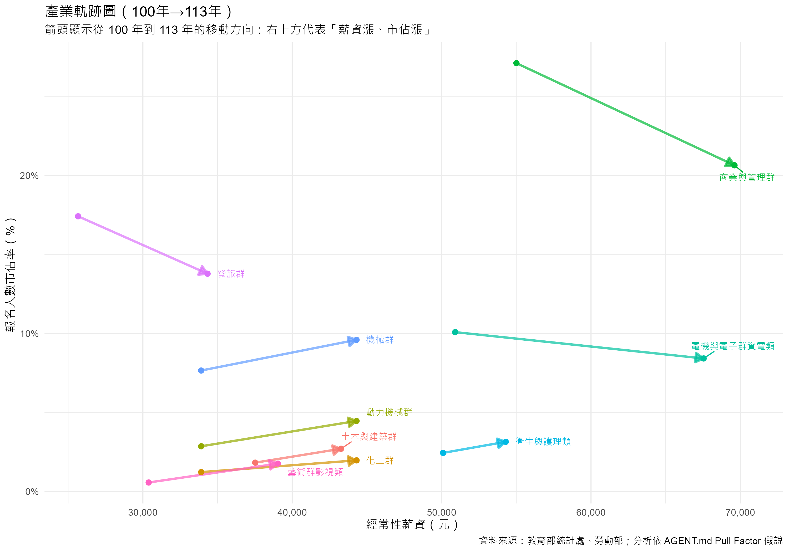

# 3.4 市場佔有率的動態軌跡

## 3.4.1 從絕對人數到市場佔有率

前一節我們討論了絕對人數的變化，確認了高薪資的抗跌性。然而，要真正理解學生如何在不同產業間移動，我們必須排除總體人數下降的干擾，改以**「市場佔有率 (Market Share)」**作為觀察指標。

當我們將視角轉換為「市佔率」時，原本被少子化掩蓋的動態變化便浮現出來。本節將探討薪資如何產生「磁吸效應 (Magnetic Effect)」，驅動學生從低薪領域向高薪領域移動，改變技職教育的版圖。

## 3.4.2 產業軌跡分析 (Trajectory Analysis)

為了直觀展示這種流動，我們繪製了「產業軌跡圖」，追蹤各群類從 100 年（起點）到 113 年（終點）在「薪資-市佔率」平面上的移動路徑。

### 視覺化分析：產業軌跡圖

圖中箭頭顯示了各群類的演變方向：

1.  **向右上方移動（贏家圈）**：

    - **電機與電子群資電類**、**衛生與護理類**等高薪群類，呈現明顯的「向右上方」移動趨勢。這代表隨著薪資的持續成長，其在全體學生中的佔比也隨之攀升。
    - 這正是「磁吸效應」的最佳佐證：高薪資成功吸引了更高比例的學生投入，即使總體人數減少，這些領域的相對重要性卻在提升。

2.  **向左下方移動（輸家圈）**：
    - **餐旅群**等部分低薪群類，則呈現「向左下方」或「向下方」移動的趨勢。這意味著它們不僅薪資成長相對緩慢，市佔率也在不斷流失。
    - 學生正用腳投票，逐漸撤離這些相對低回報的領域。

## 3.4.3 3 年週期迴歸分析

為了進一步驗證這種趨勢的長期穩定性，我們引入了「3 年 1 動」的週期分析。考量到教育選擇的滯後性，我們計算了每 3 年的薪資成長率與市佔率成長率，並觀察其關聯。

### 視覺化分析：3 年週期迴歸圖

### 統計檢定結果

- **模型顯著性**：F-statistic = 0.022, **p-value = 0.8824** (> 0.05)。
- **解釋力**：$R^2$ 趨近於 0 (0.00028)。

### 分析與發現

透過過濾短期雜訊後的 3 年週期分析，統計結果顯示**整體而言，薪資成長率與市佔率成長率之間並無顯著的線性關係**。這帶來了更深層的洞察：

1.  **成長率的脫鉤**：即使將觀察週期拉長至 3 年，單純的「加薪幅度」仍不足以解釋「學生人數佔比的變化」。這再次印證了前一節的結論——學生並非追逐「成長率」，而是追逐「絕對高薪」。
2.  **特定群類的磁吸**：雖然整體迴歸不顯著，但從散佈圖中可見，特定高薪群類（如資電類）在特定時期確實呈現了「薪資漲、市佔漲」的趨勢。這暗示了磁吸效應可能存在**門檻**——只有當薪資水準達到一定高度，且配合產業前景（如 AI 熱潮）時，成長率才會轉化為吸引力。

## 3.4.4 小結

綜合本節分析，我們發現薪資的第二層作用：**磁吸**，但這種磁吸效應具有特殊的運作機制。

在存量競爭的時代，高薪資確實能「進攻」（吸引市佔），如產業軌跡圖所示，高薪群類長期往右上方移動。然而，這種移動並非由短期的薪資調漲率線性驅動（3 年週期迴歸不顯著），而是源於**長期累積的「高薪形象」與產業地位**。學生群體正經歷一場結構性的重分配，資源與人才逐漸向高附加價值的產業集中，這可能導致技職教育體系內部發展的兩極化。
