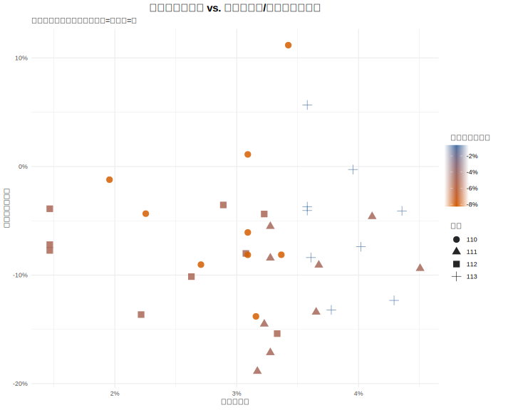

# 3.4 進階迴歸模型：檢驗增長率的動態關係

在 3.3 節的視覺化分析中，圖中的迴歸趨勢線呈現非常平緩的負斜率，初步顯示「薪資年增率」與「報名人數年增率」之間可能並無顯著的正向線性關係。為了用更嚴謹的統計方法來檢驗這個視覺觀察，本節將建立一個以「增長率」為核心變數的進階迴歸模型，並納入「出生人口年增率」作為關鍵控制變數，探討其交互作用。

---

### 3.4.1 分析方法

本節採用**多元線性迴歸模型 (Multiple Linear Regression)**，並進一步納入交互作用項，檢驗三變數間的動態關係：

1. **單變數模型 (Model 1)**：
   $$ Y*i = \beta_0 + \beta_1 X*{1i} + \epsilon_i $$

   - $Y_i$：第 $i$ 筆的「報名人數年增率」
   - $X_{1i}$：第 $i$ 筆的「薪資年增率」

2. **多變數模型 (Model 2)**：
   $$ Y*i = \beta_0 + \beta_1 X*{1i} + \beta*2 X*{2i} + \epsilon_i $$

   - $X_{2i}$：第 $i$ 筆的「出生人口年增率」
   - 此模型用於檢驗在控制人口結構變動後，薪資是否仍對招生有影響。

3. **交互作用模型 (Model 3)**：
   $$ Y*i = \beta_0 + \beta_1 X*{1i} + \beta*2 X*{2i} + \beta*3 (X*{1i} \times X\_{2i}) + \epsilon_i $$
   - $X_{1i} \times X_{2i}$：薪資年增率與出生人口年增率的交互作用項
   - 此模型用於檢驗薪資對招生的影響力，是否會因人口結構（少子化程度）的不同而產生變化。

---

### 3.4.2 分析結果與討論

本節依序檢驗三個模型的統計結果。

#### 1. 單變數模型結果

```
Call:
lm(formula = 報名人數年增率 ~ 薪資年增率, data = analysis_data_for_regression)

Coefficients:
            Estimate Std. Error t value Pr(>|t|)
(Intercept) -0.06786    0.04444  -1.527    0.136
薪資年增率  -0.14605    1.35537  -0.108    0.915

Multiple R-squared:  0.0003414, Adjusted R-squared:  -0.02906
F-statistic: 0.01161 on 1 and 34 DF,  p-value: 0.9148
```

**結果判讀：**

- **薪資年增率** ($p=0.915$)：未達顯著水準，且係數為負，顯示單純的薪資增長無法解釋報名人數的變化。
- **模型解釋力** ($R^2 \approx 0$)：模型完全無法解釋變異。

#### 2. 多變數模型結果 (加入出生人口年增率)

```
Call:
lm(formula = 報名人數年增率 ~ 薪資年增率 + 出生人口年增率,
    data = analysis_data_for_regression)

Residuals:
      Min        1Q    Median        3Q       Max
-0.116156 -0.033630 -0.006302  0.033919  0.180910

Coefficients:
                Estimate Std. Error t value Pr(>|t|)
(Intercept)    -0.077051   0.062921  -1.225    0.229
薪資年增率      0.008034   1.559193   0.005    0.996
出生人口年增率 -0.092503   0.441539  -0.210    0.835

Residual standard error: 0.06287 on 33 degrees of freedom
Multiple R-squared:  0.001669,  Adjusted R-squared:  -0.05884
F-statistic: 0.02759 on 2 and 33 DF,  p-value: 0.9728
```

**結果判讀：**

- **出生人口年增率** ($p=0.835$)：統計結果顯示，出生人口的變動在此模型中並未呈現顯著影響。這可能是因為「年增率」的計算方式消除了長期的人口下降趨勢，僅保留了年度間的短期波動，而這些短期波動對招生人數的立即影響不明顯。
- **薪資年增率** ($p=0.996$)：在控制了人口變數後，薪資的影響力依然極低且不顯著。
- **模型整體** ($p=0.9728$)：多變數模型整體依然無法有效解釋報名人數的年度變動。

#### 3. 交互作用模型結果

```
Call:
lm(formula = 報名人數年增率 ~ 薪資年增率 * 出生人口年增率,
    data = analysis_data_for_regression)

Residuals:
      Min        1Q    Median        3Q       Max
-0.108151 -0.039591 -0.002544  0.034477  0.188460

Coefficients:
                          Estimate Std. Error t value Pr(>|t|)
(Intercept)                -0.2216     0.1481  -1.496    0.144
薪資年增率                  3.9872     4.0066   0.995    0.327
出生人口年增率             -2.9767     2.7123  -1.097    0.281
薪資年增率:出生人口年增率  83.9600    77.9092   1.078    0.289

Residual standard error: 0.06272 on 32 degrees of freedom
Multiple R-squared:  0.03663,   Adjusted R-squared:  -0.05368
F-statistic: 0.4056 on 3 and 32 DF,  p-value: 0.75
```

**結果判讀：**

- **交互作用項** (`薪資年增率:出生人口年增率`)：係數為 83.96，雖然數值龐大且為正值，但 p 值為 0.289，未達統計顯著水準。這暗示了兩者間可能存在某種複雜的連動關係，但在目前的樣本與模型設定下無法被證實。
- **整體結論**：即使納入了交互作用，模型整體的 p 值 (0.75) 仍顯示不顯著。這強化了本研究的發現——短期的「薪資波動」與「人口波動」並非驅動「報名人數波動」的主要線性原因。

---

### 3.4.3 小結與限制

綜合 Model 1 至 Model 3 的統計證據，本研究得出以下結論：

1.  **短期波動無顯著關聯**：無論是單獨的薪資變化、人口變化，或是兩者的交互作用，都無法顯著解釋報名人數的年度增減率。
2.  **趨勢 vs. 波動**：這可能意味著，學生選擇科系的決策是基於「長期趨勢」（如某產業長期的低薪印象）或「絕對水準」（薪資的絕對值），而非對於「年度加薪幅度」（薪資年增率）的立即反應。
3.  **非經濟因素的重要性**：統計上的「無結果」反向凸顯了非量化因素（如社會價值觀、家長期待、政策導向）在技職教育選擇中可能扮演更關鍵的角色。

**資料限制：**
本研究僅以公開年度資料為基礎，樣本數較少（n=36），且「年增率」的轉換可能過濾掉了重要的長期趨勢資訊。建議未來研究可改採面板資料分析 (Panel Data Analysis) 或探討薪資「絕對值」與報名人數「總量」之間的長期共整合關係。

#### 3.4.3 綜合討論：統計不顯著的深層意涵

統計上的「不顯著」，恰好印證了 3.3 節提出的「抗跌理論」。

如果學生的決策是基於「今年的加薪幅度」（短期波動），那麼我們應該會看到顯著的正相關。然而，模型顯示並非如此。這暗示了學生在做選擇時，看重的並非「今年誰加薪多」，而是「誰長期以來就是高薪行業」（絕對優勢）。

這解釋了為何 3.3 節中高薪群類較抗跌，但 3.4 節中薪資年增率卻無法預測招生變化——**因為學生看的是「好工作」（存量概念），而不是「今年剛好加薪的工作」（流量概念）。** 薪資的作用在於「留住」生源，而非透過短期的調薪來「刺激」生源。

---

### 3.4.4 三維視覺化補充

為更直觀呈現三變數的聯合關係，本節補充三維散佈圖：


_圖 3.4.1：報名人數年增率 vs. 薪資年增率/出生人口年增率。顏色代表出生人口年增率（綠=高、紅=低）。_

圖中每個點的顏色由出生人口年增率決定，能一目了然觀察人口變動與招生變化的關聯性。建議搭配上述交互作用模型結果一同解讀。
