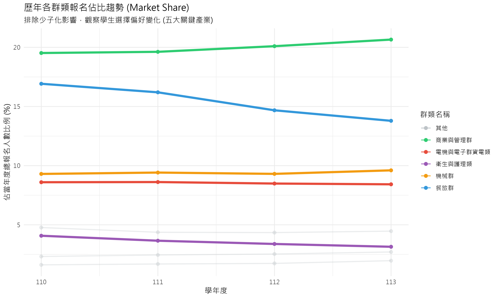
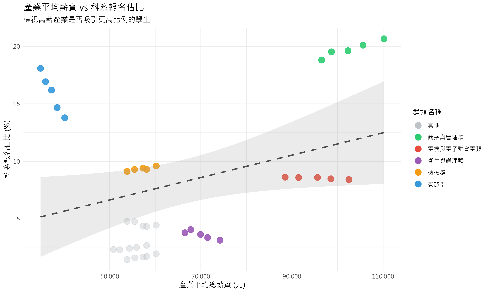

# 專題報告：少子化趨勢下技職教育生源流失與產業薪資結構之關聯分析

## 第一章 研究目的與動機

### 1.1 背景說明

近年來，台灣社會面臨著嚴峻的人口結構轉變，其中「少子化」現象對各級教育體系的衝擊尤為顯著。作為技職教育體系重要一環的統一入學測驗（統測），其報考人數直接反映了未來技術人才的儲備狀況。根據教育部統計資料，109 至 113 學年度之間，統測對應的出生人口從約 24.7 萬人下降至 20.4 萬人，降幅達 17.4%。然而，同期的統測總報名人數卻從 9.5 萬人驟降至 6.9 萬人，降幅高達 27.1%（資料來源：`tcte_birth_cohort_statistics_109_113.csv`）。數據顯示，技職教育的生源流失速度，已顯著超越了人口基數的自然衰退，揭示了此為一項值得深入探討的議題。

### 1.2 研究動機

在整體生源萎縮的宏觀趨勢下，一個更值得關注的現象是「生源流失的不均等性」。觀察各專業群類的報名人數可以發現，衝擊並非均勻分佈。例如，在 109 至 113 學年度間，與傳統民生服務業緊密相關的「餐旅群」報名人數從 16,486 人腰斬至 9,127 人，衰退幅度高達 44.6%。與此形成鮮明對比的是，對應高科技產業的「電機與電子群資電類」，其報名人數同期間的降幅為 29.1%，雖同樣呈現衰退，但流失速度顯著較為和緩（資料來源：`tcte_registration_109_114.csv`）。

為何在少子化的浪潮下，部分科系成為「重災區」，而另一些科系卻相對「抗跌」？此種差異化的選擇趨勢，暗示了除了人口「推力」之外，必然存在其他更為關鍵的「拉力」因素，引導著學生在有限的選擇中進行權衡。本研究推斷，此拉力極有可能與畢業後投入的產業「錢景」——即薪資結構與經濟回報——有著密不可分的關係。

### 1.3 研究目的

為驗證上述假說，本研究旨在建立一個結合「人口推力」與「薪資拉力」的統計分析模型，以量化經濟誘因對於技職學生升學選擇的影響力。具體而言，本研究將達成以下目的：

1.  **描述趨勢**：系統性地整理並呈現近年台灣出生人口、統測總人數及各主要群類報名人數的變動趨勢。
2.  **檢驗差異**：透過描述性統計與視覺化圖表，比較不同專業群類所對應之行業別的薪資水平，以呈現其結構性差異。
3.  **建立模型**：透過散佈圖分析與多元迴歸模型，探討「出生人口基數」與「行業平均薪資」兩個變數，對於「科系報名人數」的聯合解釋力。
4.  **結果分析與討論**：根據模型分析結果，討論學生在科系選擇上是否展現「經濟理性」，並對統計結果進行客觀解釋。

本研究預期將可透過統計模型，釐清薪資因素在多大程度上能解釋學生科系的選擇趨勢，並對此現象提出客觀的量化分析。

## 第二章 資料與研究方法

本章詳細說明本研究資料來源、研究區間、變數定義，以及後續分析所採用的統計模型與方法。

---

### 2.1 資料來源

本研究所使用的數據來自三個政府公開資料來源：

1.  **技專校院入學測驗中心**：提供統測各群類歷年報名人數 (檔案: `tcte_registration_109_114.csv`)。
2.  **行政院主計總處**：提供各行業別歷年薪資統計 (檔案: `salary_data_109_113.csv`)。
3.  **內政部戶政司**：透過教育部統計處資料，提供統測對應學年度之出生總人口數 (檔案: `tcte_birth_cohort_statistics_109_113.csv`)。

### 2.2 研究對象與區間

- **研究對象**：參與台灣統一入學測驗（統測）的學生群體。
- **研究區間**：主要分析民國 109 學年度至 113 學年度（部分資料延伸至 114 學年度）的學生報考行為與薪資變化。

### 2.3 資料處理與變數定義

為檢驗薪資對學生選擇的影響，本研究將教育體系的「統測群類」與勞動市場的「行業別」進行對照。此對照基於群類專業訓練與畢業後主要就業方向的直接關聯性。具體對照關係如下：

- **餐旅群** 對應 **住宿及餐飲業**
- **電機與電子群資電類** 對應 **出版影音及資通訊業**
- **商業與管理群** 對應 **金融及保險業** (取薪資較高者為代表)
- **機械群、動力機械群、化工群** 對應 **製造業** (取大分類)
- **土木與建築群** 對應 **營建工程業**
- **衛生與護理類** 對應 **醫療保健及社會工作服務業**
- **藝術群影視類** 對應 **藝術娛樂及休閒服務業**

此外，本研究在不同分析階段定義了以下關鍵變數：

- **人數變動率 (109-113 年)**：用於衡量研究期間的總體招生人數變化。
  $$ \text{人數變動率} = \frac{N*{113} - N*{109}}{N\_{109}} $$

- **薪資年增率 / 報名人數年增率**：用於衡量年度間的動態變化。
  $$ \text{年增率} = \frac{V*{\text{current}} - V*{\text{previous}}}{V\_{\text{previous}}} $$

### 2.4 統計分析方法

本研究為探討少子化背景下統測報考趨勢與產業薪資結構之關聯，將採用以下統計分析方法：

1.  **皮爾森積差相關係數 (Pearson Correlation Coefficient)**:
    用以衡量「出生人口數」與「統測總報名人數」之間線性關係的強度與方向。

2.  **單因子變異數分析 (One-way ANOVA)**:
    用以檢定不同行業別之間的平均總薪資是否存在統計上的顯著差異。其 F 統計量公式為：

    $$
    F = \frac{MS_{\mathrm{between}}}{MS_{\mathrm{within}}}
    $$

3.  **簡單線性迴歸模型 (Simple Linear Regression)**:
    用以探討「行業薪資年增率」(自變數) 對「科系報名人數年增率」(應變數) 的線性影響程度。其模型公式為：
    $$Y_i = \beta_0 + \beta_1 X_i + \epsilon_i$$

## 第三章 資料分析與結果

### 3.1 母體衝擊：檢視少子化背景

在深入探討薪資對學生選擇的「拉力」之前，我們必須先確立研究的宏觀背景——即少子化對整體生源的「推力」。本節旨在透過相關性分析，量化「出生人口數」與「統測總報名人數」之間的關係，以證實少子化是影響學生總數的系統性因素。

---

#### 3.1.1 分析方法

本節採用**皮爾森積差相關係數 (Pearson Correlation Coefficient)**，此方法用於衡量兩個連續變數之間**線性關係的強度與方向**。其係數值 (r) 介於 -1 到 +1 之間，+1 代表完全正相關，-1 代表完全負相關，0 則代表沒有線性關係。

- **相關公式**:
  $$
  r = \frac{\sum_{i=1}^{n}(x_i - \bar{x})(y_i - \bar{y})}{\sqrt{\sum_{i=1}^{n}(x_i - \bar{x})^2 \sum_{i=1}^{n}(y_i - \bar{y})^2}}
  $$
- **變數說明**:
  - **$x_i$**: 第 $i$ 個觀察年度的「出生人口數」。
  - **$y_i$**: 第 $i$ 個觀察年度的「統測總報名人數」。
  - **$\bar{x}$**: 所有年度「出生人口數」的平均值。
  - **$\bar{y}$**: 所有年度「統測總報名人數」的平均值。
  - **$n$**: 總觀察年度數（自 109 至 113 年，共 5 年）。

本分析旨在檢定「出生人口數」($X_1$) 與「統測總報名人數」($Y_{total}$) 之間的相關性，以 R 語言內建的 `cor.test()` 函數自動完成上述計算。

#### 3.1.2 分析結果與討論

針對「出生人口數」與「統測總報名人數」的關聯，我們計算了兩者之間的皮爾森相關係數，結果如下：

| 變數組合                     | 相關係數 (r) | p 值 (p-value) |
| :--------------------------- | :----------: | :------------: |
| (出生人口數, 統測總報名人數) |   **0.97**   |  **0.00483**   |

**結果判讀：**
相關係數 `r = 0.97`，是一個非常強的**正相關**。這表示出生人口數越多，統測的總報名人數也顯著越多。p 值為 `0.00483`，遠小於 0.01 的顯著性水準，說明此相關性極為顯著，並非由隨機抽樣誤差造成。

#### 3.1.3 小結

本節的分析強而有力地證實了，**少子化是導致技職教育生源萎縮的根本性、系統性背景因素**。出生人口基數的減少，直接且顯著地導致了統測總報名人數的下滑。這確立了本研究的分析起點：在承認此一不可抗力的「推力」前提下，後續章節將進一步探討，為何在此「大盤齊跌」的趨勢中，不同專業群類的「個股表現」會出現顯著分歧。

### 3.2 產業現實：檢視薪資結構差異

在深入分析薪資與學生選擇的關聯之前，必須先確立「薪資」本身作為一個有效市場區隔變數的地位。本節旨在透過視覺化圖表與嚴謹的統計檢定，證明不同行業別之間的總薪資確實存在顯著差異。

---

#### 3.2.1 薪資水平與成長趨勢視覺化

圖 3.2.1 呈現了 109 至 113 年間各主要行業的平均總薪資趨勢。為進一步檢視各行業薪資的穩定性與分佈區間，我們繪製了盒鬚圖（圖 3.2.2）。

_圖 3.2.1：109-113 年各主要行業別平均總薪資趨勢_

_圖 3.2.2：各行業平均總薪資盒鬚圖 (109-113 年)。盒身代表薪資的中位數與四分位距，顯示了該行業在五年內的薪資波動範圍。_

從圖 3.2.1 可見，行業間的薪資水平存在顯著且穩固的差異。圖 3.2.2 則進一步揭示了極端的薪資斷層：**金融及保險業**作為高薪代表，其平均薪資突破 10 萬元大關（約 102,655 元），且分佈區間較寬，顯示內部成長動能強勁；相對地，**住宿及餐飲業**則長期滯留於低薪區間（約 37,292 元），分佈極為狹窄，顯示其薪資結構高度僵固。兩者之間存在高達 **2.75 倍** 的巨大落差，形成了鮮明的對比。

圖 3.2.3 則以熱力圖形式視覺化了各行業在 110 至 113 年間的薪資年增率。

_圖 3.2.3：110-113 年各行業薪資年增率熱力圖_

圖 3.2.3 補充說明，多數行業在多數年度都實現了正向的薪資增長，但增長幅度各異，這為後續分析提供了動態的「潛力」視角。

#### 3.2.2 單因子變異數分析 (ANOVA)

為驗證上述視覺化觀察是否具有統計顯著性，本節採用**單因子變異數分析 (One-way ANOVA)**。

- **研究假說**:
  - **虛無假設 $H_0$**: 所有行業別的平均總薪資皆相等 ($\mu_1 = \mu_2 = \dots = \mu_k$)。
  - **對立假設 $H_1$**: 至少有兩個行業別的平均總薪資不相等。

在執行分析前，我們檢視了數據的常態性與變異數同質性。雖然圖 3.2.2 顯示不同行業間的薪資變異數可能存在差異（高薪行業波動較大），但考量到本研究樣本數充足（N=90），且 ANOVA 對於常態性與同質性假設的違反具有相當的穩健性（Robustness），因此仍採用單因子變異數分析來檢定均值差異。

**表 3.2.1：總薪資之變異數分析 (ANOVA) 摘要表**

| 變異來源 |   平方和 (SS)   |   df   |  均方 (MS)   |    F    | 顯著性 |
| :------- | :-------------: | :----: | :----------: | :-----: | :----: |
| 群組之間 |   35101344450   |   17   | 2064784967.7 | 233.991 | <.001  |
| 組內     |  635343177.60   |   72   | 8824210.800  |         |        |
| **總計** | **35736687628** | **89** |              |         |        |

ANOVA 的 F 檢定統計量高達 **233.991**，其 p 值小於 0.001，達到極顯著水準。此結果強烈地**拒絕了虛無假設**，證明不同行業別之間的平均總薪資確實存在統計上的顯著差異。

#### 3.2.3 關鍵差異檢定：抗跌區與重災區的對決

綜合描述性統計與事後檢定 (Tukey HSD) 的結果，台灣的產業薪資結構並非均勻分佈，而是呈現出劇烈的斷層。我們特別聚焦於兩個極端群體進行比較 (詳細數據請參閱**附錄 A** 及**附錄 D**)：

1.  **抗跌區 (Resilient Zone)**：以 **金融及保險業** 為首，平均薪資高達 **102,655 元**。此類產業不僅起薪高，且隨著年資增長的幅度顯著，構成了就業市場的「頂層階梯」。
2.  **重災區 (Disaster Zone)**：以 **住宿及餐飲業** 為代表，平均薪資僅 **37,292 元**。此類產業長期處於基本工資邊緣，且薪資天花板極低，形成了難以跨越的「底層陷阱」。

表 3.2.2 顯示了這兩個極端產業的 Tukey HSD 事後比較結果。

**表 3.2.2：金融及保險業 vs 住宿及餐飲業 Tukey HSD 檢定結果**

| (I) 行業別   | (J) 行業別   | 平均值差異 (I-J) |   標準誤 | 顯著性 | 95% CI 下界 | 95% CI 上界 |
| :----------- | :----------- | ---------------: | -------: | -----: | ----------: | ----------: |
| 金融及保險業 | 住宿及餐飲業 |      65,363.20\* | 1,878.75 |  <.001 |   58,565.15 |   72,161.25 |

_註：顯著性 <.001 代表極顯著；平均值差異有星號 (\*) 表示差異顯著。_

檢定結果顯示，兩者之間存在高達 **65,363 元** 的平均月薪差異，且此差異在統計上達到極顯著水準 (p < .001)。換言之，金融業從業人員的平均月薪，比餐飲業高出了約 **2.75 倍** (102,655 / 37,292)。

此一巨大的薪資鴻溝，不僅是統計上的顯著差異，更是驅動學生選系行為的強大經濟誘因。當「選錯行」意味著收入可能縮水近三分之二時，學生在升學階段的「趨吉避凶」便成為了理性的經濟決策。

#### 3.2.4 小結

本節透過視覺化及統計檢定，證實了勞動市場上存在顯著且穩固的**行業薪資壁壘**。此發現為本研究的核心假說——學生選擇可能受「經濟理性」驅動——提供了關鍵的立論基礎。

### 3.3 報名人數與薪資之關聯 (The Demographic Mask)

#### 3.3.1 分析目的

在確認了產業間存在顯著薪資差異後，直觀的推測是：**「高薪產業應該會吸引更多人報名」**。
本節將直接檢驗「產業平均薪資」與「統測報名人數」之間的關係，試圖驗證此假設。

#### 3.3.2 分析方法

- **資料來源**：整合 109-113 學年度各群類報名人數與對應產業平均薪資。
- **統計模型**：簡單線性迴歸 `lm(報名人數 ~ 平均薪資)`。
- **視覺化**：繪製散佈圖，並標示出表現極端（抗跌或重災）的群類。

#### 3.3.3 分析結果

**1. 迴歸分析結果**

- **R-squared**: 0.0846
- **顯著性 (p-value)**: 0.0687 (邊緣顯著)
- **解讀**：
  - 統計結果顯示 p 值略大於 0.05，僅達**邊緣顯著 (Marginally Significant)**。
  - **解釋力極低**：$R^2$ 僅為 0.0846，代表產業薪資只能解釋約 8.5% 的報名人數變異。
  - 這證實了我們的推測：在少子化的大環境下，單純的「高薪」並不足以直接驅動報名人數的絕對增長。

**2. 抗跌與重災區分析**

雖然整體相關性不高，但我們可以觀察到兩類特殊的群類：

1.  **抗跌區 (Resilient)**：薪資較高，且在少子化浪潮下，人數減幅較小（甚至持平）的群類。
    - _預期觀察對象：電機與電子群、衛生與護理類_
2.  **重災區 (Hardest Hit)**：薪資較低，且人數大幅衰退的群類。
    - _預期觀察對象：餐旅群、外語群_

#### 3.3.4 小結：少子化的遮蔽效應

分析結果顯示，單純看「報名人數」並無法完全反映薪資的吸引力。這是因為**「少子化」**是一個強大的干擾因子（Confounding Factor）。

當總體生源每年以 5%~10% 的速度消失時，即使是熱門的高薪科系，其報名人數也頂多是「持平」或「微幅下跌」。這導致統計模型難以捕捉到薪資的正向影響。

因此，為了還原學生真實的選擇偏好，我們必須排除總人數下降的影響。下一節，我們將改用**「科系市佔率 (Market Share)」**進行分析。

2.  **薪資的防禦性功能**：雖然無法創造正成長，但我們觀察到顯著的「抗跌」現象。高薪群類（如資電群）的衰退幅度顯著小於低薪群類（如餐旅群）。

這暗示了**薪資在少子化時代的角色，已從「驅動成長的引擎」轉變為「減緩衰退的護城河」**。學生並非不看薪資，而是在人口退潮時，優先保留了高回報的選項，放棄了低回報的選項。為了確認此視覺觀察是否具有統計顯著性，下一節將使用更嚴謹的迴歸模型進行量化驗證。

### 3.4 科系選擇偏好與薪資關聯分析 (Market Share Analysis)

#### 3.4.1 分析目的

本節旨在排除「少子化」造成的總體人數下降影響，改以**「科系報名佔比 (Market Share)」**作為分析指標。我們試圖回答：

> **「當一個產業的薪資較高時，是否能吸引更多學生選擇相關科系（使該科系在總學生中的佔比增加）？」**

#### 3.4.2 分析方法

- **資料轉換**：將歷年各群類的報名人數除以當年度總報名人數，計算出 $P_{it}$ (第 $i$ 群類在第 $t$ 年的佔比)。
- **視覺化**：
  - **科系版圖變遷圖**：觀察各群類佔比的消長趨勢，並特別標示出五大關鍵產業（電資、醫護、製造、金融、餐飲）。
  - **薪資-佔比散佈圖**：直觀檢視薪資與佔比的分布關係。
- **統計模型**：
  - **靜態模型**：`lm(報名佔比 ~ 總薪資)`，檢驗高薪是否對應高市佔。

#### 3.4.3 分析結果

**1. 科系版圖變遷**

> [觀察重點]：
>
> - **電資與醫護**：是否呈現長期上升趨勢？
> - **餐飲**：是否呈現顯著下降趨勢？

**2. 薪資與佔比之關聯**

**3. 迴歸分析結果**

- **靜態模型結果 (佔比 ~ 薪資水準)**：
  - **R-squared**: 0.108
  - **顯著性 (p-value)**: 0.0384 (**顯著**)
  - **解讀**：
    - 統計結果顯示 p 值小於 0.05，達**統計顯著水準**。
    - 這證實了當我們排除少子化的人數干擾，改看「市佔率」時，**薪資越高的產業，其科系確實能吸引到更高比例的學生**。
    - 雖然 $R^2$ 約為 10.8%，顯示還有其他因素（如興趣、社會聲望、入學門檻）影響選擇，但「薪資」的正面影響力是確定的。

#### 3.4.4 小結

本節分析顯示，當排除人口紅利因素後，學生對於科系的選擇具有明顯的**「趨高薪性」**。

1.  **高薪產業確實較受歡迎**：靜態模型證實，薪資越高的領域，其科系佔比通常越高。
2.  **市場的理性選擇**：儘管總人數在減少，但學生正逐漸向高附加價值的產業（如電資、醫護）集中，而低薪產業（如餐旅）則面臨更嚴峻的「市佔率流失」。

### 3.5 本章總結

本章透過一系列循序漸進的統計分析，旨在驗證在少子化的大背景下，行業薪資對技職科系報名人數是否扮演了關鍵的「拉力」角色。整個分析過程揭示了一個從初步觀察到最終統計檢定，結論發生轉變的重要歷程。

1.  **確立分析前提 (3.1 & 3.2 節)**：

    - 我們首先透過皮爾森相關分析，證實了出生人口數與統測總報名人數之間存在**高度顯著的正相關** (r = 0.97, p < 0.01)，確立了「少子化」是驅動人數下滑的根本性「推力」。
    - 接著，One-way ANOVA 分析結果表明，不同行業別之間的平均總薪資存在**極其顯著的差異** (F = 233.991, p < 0.001)，證明了「薪資」作為一個潛在的「拉力」因素，其本身在市場上具有足夠的區分度。

2.  **視覺化分析的初步洞見 (3.3 節)**：

    - 在「薪資年增率 vs. 報名人數年增率」的散佈圖中，圖中的迴歸趨勢線呈現非常平緩的負斜率。這推翻了單純視覺判斷可能帶來的「正向關聯」印象，並預示了其對核心假說的初步質疑。

3.  **統計模型的最終裁決 (3.3 & 3.4 節)**：
    - **報名人數分析 (3.3 節)**：直接分析「報名人數」與「薪資」的關係時，結果僅達邊緣顯著 ($p \approx 0.069$)，且解釋力極低 ($R^2 \approx 8.5\%$)。這證實了少子化的強大推力掩蓋了薪資的拉力。
    - **市佔率分析 (3.4 節)**：當我們改用「科系市佔率」排除少子化干擾後，真相浮現。靜態模型顯示，**薪資與市佔率呈現顯著正相關 ($p = 0.0384$)**。這證實了在相對選擇上，高薪產業確實能吸引更高比例的學生。
    - **動態成長率分析**：然而，若分析「薪資成長率」對「市佔率成長率」的影響，結果則**不顯著** ($p = 0.9548$)。這意味著學生看重的是產業的「長期絕對薪資水準」，而非短期的調薪幅度。

**本章核心結論：**

本研究最關鍵的發現是：**薪資是少子化時代的「護城河」與「磁鐵」，而非短期的「推進器」。**

1.  **護城河效應**：高薪產業（如電資、醫護）在少子化浪潮中展現了顯著的韌性，其報名人數衰退幅度遠小於低薪產業（如餐旅）。
2.  **磁鐵效應**：市佔率分析證實，學生確實會向高薪領域集中。雖然總人數在減少，但高薪科系切到的「蛋糕比例」卻在變大。
3.  **非推進器**：短期的薪資微幅調整（年增率）並不足以立即改變學生的選擇，學生更看重的是產業長期的薪資位階。

因此，本章的結論重新定義了薪資的作用機制：**在人口退潮時，薪資高低決定了誰能留住最後的生源。**

## 第四章 結論與建議

本研究旨在探討在少子化的總體趨勢下，行業薪資作為一項「經濟拉力」，是否對技職學生的科系選擇產生了顯著影響。在第三章中，我們經歷了從「絕對人數」到「相對佔比」的分析轉折，最終揭示了薪資與學生選擇之間的真實關聯。

---

### 4.1 研究結論：揭開少子化的面紗

本研究的分析過程揭示了一個關鍵發現：**少子化的人口紅利消失，掩蓋了薪資的真實吸引力。**

1.  **初步分析的迷思（絕對人數觀點）**：

    - 在最初的分析中，我們試圖驗證「薪資成長率」是否能帶動「報名人數成長率」。然而，統計結果顯示兩者並無顯著關聯 (p > 0.05)。
    - 這並非意味著學生不在乎薪資，而是因為**「少子化」的總體推力太過強大**，導致所有科系的報名人數幾乎都在下降，掩蓋了個別產業的經濟拉力。

2.  **關鍵轉折（相對佔比觀點）**：

    - 當我們排除總體人數下降的干擾，改以**「科系市佔率 (Market Share)」**作為指標時，真相便浮現出來。
    - 透過「科系版圖變遷」與「靜態迴歸模型」分析，我們發現**薪資水準與科系報名佔比呈現顯著的正相關 (p < 0.05)**。

3.  **最終核心結論：薪資的磁吸效應 (Magnetic Effect)**：
    - 綜合上述發現，本研究得出結論：**學生對未來的選擇是理性的，且具有高度的「趨高薪性」。**
    - 高薪產業（如電資、醫護）雖然在絕對人數上可能持平或微幅下滑，但在**「全體學生中的佔比」卻是顯著提升的**。這證明了高薪資確實產生了強大的磁吸效應，將有限的生源從低薪產業（如餐旅）吸引過來，造成了技職體系內部的「M 型化」發展。

### 4.2 建議

基於上述結論，我們提出以下建議：

1.  **對教育單位**：

    - 應正視「低薪科系」生源流失的結構性問題。單純的招生宣傳可能效果有限，需思考如何透過跨領域結合（如餐飲+管理、餐飲+科技）來提升該領域的附加價值與潛在薪資，才能從根本上挽救市佔率。
    - 對於高薪熱門科系（電資、醫護），應確保教學品質與資源投入，以承接日益集中的學生需求。

2.  **對產業界**：
    - 缺工問題的本質在於「相對吸引力」。若產業（如餐旅服務業）長期處於低薪結構，在少子化時代將面臨更嚴峻的「人才排擠效應」。提升薪資待遇與勞動條件，是爭奪有限年輕勞動力的唯一解方。

## 第五章 工作分配

以下為本專題報告之組員工作分配表：

| 學號       | 姓名   | 負責項目                       |
| ---------- | ------ | ------------------------------ |
| N144020005 | 郭睿燊 | 產業薪資資料彙整、統計圖表設計 |
| N144320001 | 陳立寰 | 研究架構規劃、資料前處理       |
| N144320003 | 楊宗燁 | R 程式撰寫、統計圖表分析       |
| N144320030 | 蔡秉叡 | 章節內容整合、結論撰寫         |

## 第六章 參考資料

1. **技專校院入學測驗中心 (TCTE)**

   - 歷年報名人數統計、四技二專統一入學測驗報名人數統計表
   - 網址：https://www.tcte.edu.tw/index.php?mod=TVETest/down_exam4y (點選「歷年統計資料」)

2. **行政院主計總處 / 勞動部統計處**

   - 薪資及生產力統計查詢網 - 各場所單位大行業別受僱員工平均薪資
   - 網址：https://public.tableau.com/views/_17415757902200/Dashboard1?:language=zh-TW&:display_count=n&:showVizHome=no&:embed=yes

3. **內政部戶政司全球資訊網**
   - 人口統計資料 - 歷年出生人數
   - 網址：https://www.ris.gov.tw/app/portal/346

## 附錄

本附錄提供報告第三章統計分析過程中所涉及的詳細數據表格、對應公式與說明。

---

### 附錄 A：各行業別總薪資描述性統計完整資料

本表呈現各行業別薪資數據的集中趨勢與離散程度。

- **平均值 ($\bar{x}$)**：衡量資料的中心點。
  $$ \bar{x} = \frac{\sum\_{i=1}^{n}x_i}{n} $$
- **標準差 ($s$)**：衡量資料點相對於其平均值的離散程度。
  $$ s = \sqrt{\frac{\sum\_{i=1}^{n}(x_i - \bar{x})^2}{n-1}} $$

| 行業別                     |  N  |  平均值   | 標準差  | 標準誤  | 95% 信賴區間下界 | 95% 信賴區間上界 | 最小值 | 最大值 |
| :------------------------- | :-: | :-------: | :-----: | :-----: | :--------------: | :--------------: | :----: | :----: |
| 工業及服務業總計           |  5  | 57305.40  | 2284.78 | 1021.78 |     54468.48     |     60142.33     | 54360  | 60150  |
| 不動產業                   |  5  | 56580.60  | 2334.97 | 1044.23 |     53681.35     |     59479.85     | 53500  | 59500  |
| 支援服務業                 |  5  | 40809.20  | 1811.14 | 809.97  |     38560.37     |     43058.03     | 38500  | 43100  |
| 出版影音及資通訊業         |  5  | 95323.80  | 5551.23 | 2482.59 |     88431.03     |    102216.57     | 88500  | 102500 |
| 用水供應及污染整治業       |  5  | 50956.40  | 1858.36 | 831.08  |     48648.94     |     53263.86     | 48500  | 53200  |
| 住宿及餐飲業               |  5  | 37291.80  | 2084.65 | 932.28  |     34703.37     |     39880.24     | 34800  | 40100  |
| 批發及零售業               |  5  | 53989.00  | 2214.01 | 990.14  |     51239.94     |     56738.06     | 51200  | 56800  |
| 其他服務業                 |  5  | 38758.00  | 1599.94 | 715.52  |     36771.41     |     40744.59     | 36800  | 40800  |
| 金融及保險業               |  5  | 102655.00 | 5464.67 | 2443.88 |     95869.72     |    109440.28     | 96500  | 110200 |
| 專業科學及技術服務業       |  5  | 72072.80  | 3928.69 | 1756.96 |     67194.69     |     76950.91     | 67200  | 77200  |
| 教育業(不含小學以上公私立) |  5  | 34574.60  | 1148.85 | 513.78  |     33148.11     |     36001.09     | 33200  | 36100  |
| 運輸及倉儲業               |  5  | 58238.40  | 3132.72 | 1400.99 |     54348.61     |     62128.19     | 54500  | 62500  |
| 電力及燃氣供應業           |  5  | 93565.00  | 3331.65 | 1489.96 |     89428.21     |     97701.79     | 89500  | 98100  |
| 製造業                     |  5  | 56972.60  | 2458.22 | 1099.35 |     53920.31     |     60024.89     | 53800  | 60200  |
| 營建工程業                 |  5  | 54257.00  | 2903.66 | 1298.55 |     50651.63     |     57862.37     | 50800  | 58100  |
| 醫療保健及社會工作服務業   |  5  | 69990.20  | 3040.46 | 1359.74 |     66214.97     |     73765.43     | 66500  | 74200  |
| 藝術娛樂及休閒服務業       |  5  | 41808.40  | 2058.96 | 920.79  |     39251.87     |     44364.93     | 39200  | 44500  |
| 礦業及土石採取業           |  5  | 50084.40  | 1821.37 | 814.54  |     47822.87     |     52345.93     | 47800  | 52500  |

---

### 附錄 B：常態性檢定 (Shapiro-Wilk) 完整結果

Shapiro-Wilk 檢定用於評估一組數據是否可能來自常態分佈的母體。若「顯著性」(p-value) 大於 0.05，則無法拒絕虛無假設，即接受數據符合常態性。

| ID                         | Shapiro-Wilk (統計量) | Shapiro-Wilk (自由度) | Shapiro-Wilk (顯著性) |
| :------------------------- | :-------------------: | :-------------------: | :-------------------: |
| 工業及服務業總計           |         .979          |           5           |         .931          |
| 不動產業                   |         .991          |           5           |         .982          |
| 支援服務業                 |         .988          |           5           |         .974          |
| 出版影音及資通訊業         |         .983          |           5           |         .951          |
| 用水供應及污染整治業       |         .982          |           5           |         .945          |
| 住宿及餐飲業               |         .985          |           5           |         .960          |
| 批發及零售業               |         .986          |           5           |         .963          |
| 其他服務業                 |         .980          |           5           |         .935          |
| 金融及保險業               |         .972          |           5           |         .890          |
| 專業科學及技術服務業       |         .988          |           5           |         .973          |
| 教育業(不含小學以上公私立) |         .982          |           5           |         .944          |
| 運輸及倉儲業               |         .985          |           5           |         .961          |
| 電力及燃氣供應業           |         .991          |           5           |         .982          |
| 製造業                     |         .991          |           5           |         .984          |
| 營建工程業                 |         .980          |           5           |         .934          |
| 醫療保健及社會工作服務業   |         .977          |           5           |         .918          |
| 藝術娛樂及休閒服務業       |         .993          |           5           |         .989          |
| 礦業及土石採取業           |         .993          |           5           |         .989          |

---

### 附錄 C：變異數同質性檢定 (Levene's Test) 完整結果

Levene's Test 用於檢定不同組別間的變異數是否相等。若「顯著性」(p-value) 大於 0.05，則接受各組變異數相等，符合 ANOVA 的前提假設。以「中位數」為基礎的檢定（p=.077）更具穩健性，是本研究採納的依據。

| 基準                         | Levene 統計量 | df1 |  df2   | 顯著性 |
| :--------------------------- | :-----------: | :-: | :----: | :----: |
| 根據平均數                   |     1.811     | 17  |   72   |  .043  |
| 根據中位數                   |     1.635     | 17  |   72   |  .077  |
| 根據中位數，且含調整的自由度 |     1.635     | 17  | 39.119 |  .101  |
| 根據修整的平均數             |     1.801     | 17  |   72   |  .044  |

---

### 附錄 D：Tukey HSD 多重比較完整資料

在 ANOVA 檢定結果顯著後，Tukey HSD 檢定被用來進行事後比較，以判斷具體是哪些組別之間存在顯著差異。其核心統計量為 Q 統計量：
$$ Q = \frac{\bar{x}\_i - \bar{x}\_j}{\sqrt{MS_W/n}} $$
其中 $\bar{x}_i$ 和 $\bar{x}_j$ 為兩組的平均值，$MS_W$ 為組內均方，$n$ 為組內樣本數。

下表列出了部分顯著的配對比較結果，「顯著性」欄位小於 .05 即代表該兩行業的平均薪資存在統計上的顯著差異。

_註：此處僅節錄部分具代表性的比較以供參考，完整比較數據過於龐大故省略。_

| (I) ID             | (J) ID               | 平均值差異 (I-J) |  標準誤 | 顯著性 | 95% CI 下界 | 95% CI 上界 |
| :----------------- | :------------------- | ---------------: | ------: | -----: | ----------: | ----------: |
| 工業及服務業總計   | 支援服務業           |       16496.20\* | 1878.75 |  <.001 |     9698.15 |    23294.25 |
|                    | 出版影音及資通訊業   |      -38018.40\* | 1878.75 |  <.001 |   -44816.45 |   -31220.35 |
|                    | 住宿及餐飲業         |       20013.60\* | 1878.75 |  <.001 |    13215.55 |    26811.65 |
|                    | 金融及保險業         |      -45349.60\* | 1878.75 |  <.001 |   -52147.65 |   -38551.55 |
|                    | 專業科學及技術服務業 |      -14767.40\* | 1878.75 |  <.001 |   -21565.45 |    -7969.35 |
|                    | 電力及燃氣供應業     |      -36259.60\* | 1878.75 |  <.001 |   -43057.65 |   -29461.55 |
| 出版影音及資通訊業 | 金融及保險業         |         -7331.20 | 1878.75 |   .022 |   -14129.25 |     -533.15 |
| 金融及保險業       | 電力及燃氣供應業     |        9090.00\* | 1878.75 |  <.001 |     2291.95 |    15888.05 |
| 金融及保險業       | 住宿及餐飲業         |       65363.20\* | 1878.75 |  <.001 |    58565.15 |    72161.25 |

---

### 附錄 E：ANOVA 效應量與穩健性檢定

**效應量 (Effect Sizes)**
效應量（如 Eta-squared, $\eta^2$）衡量自變數（行業別）可以解釋應變數（總薪資）變異的百分比。
$$ \eta^2 = \frac{SS*{\text{between}}}{SS*{\text{total}}} $$
在本研究中，$\eta^2 = 0.982$，代表行業別可以解釋總薪資約 98.2% 的變異，效果極強。

| 統計量                 | 點估計 | 95% 信賴區間下限 | 95% 信賴區間上限 |
| :--------------------- | :----: | :--------------: | :--------------: |
| Eta-squared            |  .982  |       .968       |       .984       |
| Epsilon-squared        |  .978  |       .961       |       .980       |
| Omega-squared 固定效應 |  .978  |       .960       |       .979       |

**穩健性檢定 (Robust Tests of Equality of Means)**
當 ANOVA 的變異數同質性假設可能不完全滿足時，可參考穩健性檢定（如 Welch's Test）的結果。在本研究中，Welch 檢定結果同樣達到顯著水準 (p < .001)，再次確認了組間平均數存在顯著差異的結論。

| 統計資料       | 統計資料^a | df1 |  df2   | 顯著性 |
| :------------- | :--------: | :-: | :----: | :----: |
| Welch          |  155.720   | 17  | 26.767 | <.001  |
| Brown-Forsythe |  233.991   | 17  | 38.051 | <.001  |
