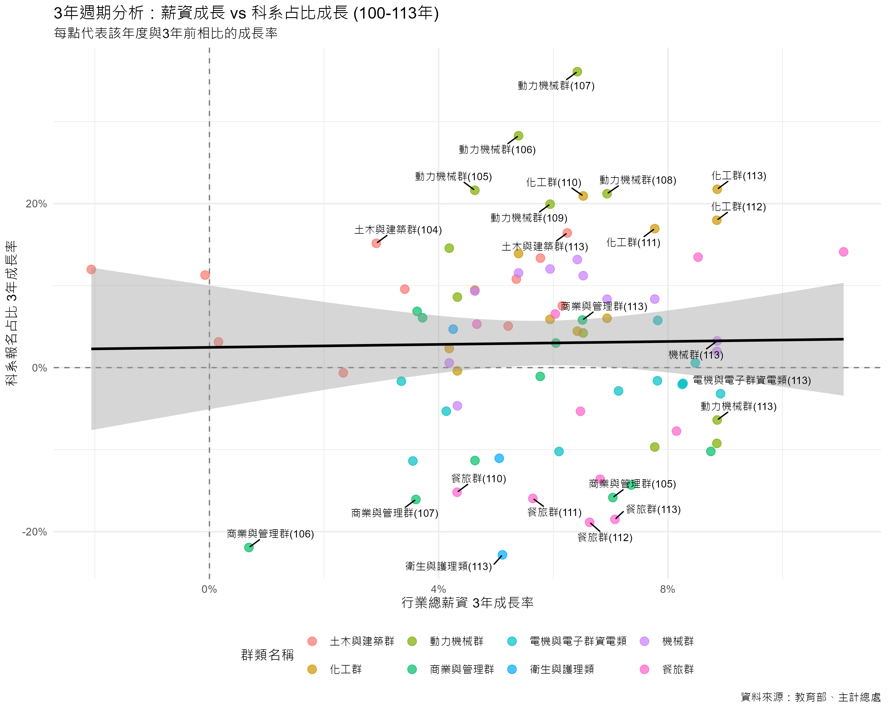

# 統計學期末報告：薪資結構對技職學生升學選擇之影響分析

**組員**：郭睿燊、陳立寰、楊宗燁、蔡秉叡
**日期**：2025-01-10

---

# 一、 研究目的與動機

### 1.1 背景說明

近年來，台灣社會面臨著嚴峻的人口結構轉變，其中「少子化」現象對各級教育體系的衝擊尤為顯著。作為技職教育體系重要一環的統一入學測驗（統測），其報考人數直接反映了未來技術人才的儲備狀況。根據教育部統計資料，109 至 113 學年度之間，統測對應的出生人口從約 24.7 萬人下降至 20.4 萬人，降幅達 17.4%。然而，同期的統測總報名人數卻從 9.5 萬人驟降至 6.9 萬人，降幅高達 27.1%（資料來源：`tcte_birth_cohort_statistics_109_113.csv`）。數據顯示，技職教育的生源流失速度，已顯著超越了人口基數的自然衰退，揭示了此為一項值得深入探討的議題。

### 1.2 研究動機

在整體生源萎縮的宏觀趨勢下，一個更值得關注的現象是「生源流失的不均等性」。觀察各專業群類的報名人數可以發現，衝擊並非均勻分佈。例如，在 109 至 113 學年度間，與傳統民生服務業緊密相關的「餐旅群」報名人數從 16,486 人腰斬至 9,127 人，衰退幅度高達 44.6%。與此形成鮮明對比的是，對應高科技產業的「電機與電子群資電類」，其報名人數同期間的降幅為 29.1%，雖同樣呈現衰退，但流失速度顯著較為和緩（資料來源：`tcte_registration_109_114.csv`）。

為何在少子化的浪潮下，部分科系成為「重災區」，而另一些科系卻相對「抗跌」？此種差異化的選擇趨勢，暗示了除了人口「推力」之外，必然存在其他更為關鍵的「拉力」因素。本研究推斷，此拉力與產業的薪資結構密切相關，並可能產生兩種效應：一是減緩流失的「穩定效應」，二是改變生源分佈的「磁吸效應」。

### 1.3 研究目的

為驗證上述假說，本研究旨在建立一個結合「人口推力」與「薪資拉力」的統計分析模型，以量化經濟誘因對於技職學生升學選擇的影響力。具體而言，本研究將達成以下目的：

1.  **描述趨勢**：系統性地整理並呈現近年台灣出生人口、統測總人數及各主要群類報名人數的變動趨勢。
2.  **檢驗差異**：透過描述性統計與視覺化圖表，比較不同專業群類所對應之行業別的薪資水平，以呈現其結構性差異。
3.  **建立模型**：透過散佈圖分析與多元迴歸模型，探討「出生人口基數」與「行業平均薪資」兩個變數，對於「科系報名人數」及「市場佔有率」的聯合解釋力。
4.  **結果分析與討論**：根據模型分析結果，討論學生在科系選擇上是否展現「經濟理性」，並對統計結果進行客觀解釋。

本研究預期將可透過統計模型，釐清薪資因素在多大程度上能解釋學生科系的選擇趨勢，並對此現象提出客觀的量化分析。

---

# 第二章：資料與研究方法

本章詳細說明本研究資料來源、研究區間、變數定義，以及後續分析所採用的統計模型與方法。

## 2.1 資料來源

本研究所使用的數據來自三個政府公開資料來源：

1.  **技專校院入學測驗中心**：提供統測各群類歷年報名人數 (檔案: `tcte_registration_100_114.csv`)。
2.  **行政院主計總處**：提供各行業別歷年薪資統計 (檔案: `salary_data_100_113.csv`)。
3.  **內政部戶政司**：透過教育部統計處資料，提供統測對應學年度之出生總人口數 (檔案: `tcte_birth_cohort_statistics_100_113.csv`)。

## 2.2 研究對象與區間

- **研究對象**：參與台灣統一入學測驗（統測）的學生群體。
- **研究區間**：主要分析民國 100 學年度至 113 學年度（部分資料延伸至 114 學年度）的學生報考行為與薪資變化。

## 2.3 資料處理與變數定義

為檢驗薪資對學生選擇的影響，本研究將教育體系的「統測群類」與勞動市場的「行業別」進行對照。此對照基於群類專業訓練與畢業後主要就業方向的直接關聯性。

### 2.3.1 統測群類與行業別對照表

本研究依據 `tcte_registration_100_114.csv` 中的群類名稱，建立以下對照關係：

- **餐旅群** 對應 **住宿及餐飲業**
- **電機與電子群資電類** 對應 **出版影音及資通訊業**
- **商業與管理群** 對應 **金融及保險業** (取薪資較高者為代表)
- **機械群、動力機械群、化工群** 對應 **製造業** (取大分類)
- **土木與建築群** 對應 **營建工程業**
- **衛生與護理類** 對應 **醫療保健及社會工作服務業**
- **藝術群影視類** 對應 **藝術娛樂及休閒服務業**

### 2.3.2 關鍵變數定義

本研究在不同分析階段定義了以下關鍵變數：

- **人數變動率 (100-113 年)**：用於衡量研究期間的總體招生人數變化。
  $$ \text{人數變動率} = \frac{N*{113} - N*{100}}{N\_{100}} $$

- **薪資年增率 / 報名人數年增率**：用於衡量年度間的動態變化。
  $$ \text{年增率} = \frac{V*{\text{current}} - V*{\text{previous}}}{V\_{\text{previous}}} $$

- **市場佔有率 (Market Share)**：某群類報名人數佔當年度總報名人數的比例，用於排除少子化總體影響。

## 2.4 統計分析方法

本研究為探討少子化背景下統測報考趨勢與產業薪資結構之關聯，將採用以下統計分析方法：

1.  **皮爾森積差相關係數 (Pearson Correlation Coefficient)**:
    用以衡量「出生人口數」與「統測總報名人數」之間線性關係的強度與方向。

2.  **單因子變異數分析 (One-way ANOVA)**:
    用以檢定不同行業別之間的平均總薪資是否存在統計上的顯著差異。

3.  **簡單線性迴歸模型 (Simple Linear Regression)**:
    用以探討「行業薪資年增率」(自變數) 對「科系報名人數年增率」(應變數) 的線性影響程度。

4.  **市場佔有率與軌跡分析 (Market Share & Trajectory Analysis)**:
    - **靜態分析**：檢視絕對薪資與市場佔有率的關聯。
    - **動態軌跡**：繪製「薪資-市佔率」軌跡圖，觀察各群類在時間軸上的移動方向。
    - **3 年週期分析**：以 3 年為一單位計算成長率，過濾短期雜訊，檢視長期趨勢。

---

# 第三章：分析結果

## 3.1 母體衝擊：檢視少子化背景

在深入探討薪資對學生選擇的「拉力」之前，我們必須先確立研究的宏觀背景——即少子化對整體生源的「推力」。本節旨在透過相關性分析，量化「出生人口數」與「統測總報名人數」之間的關係，以證實少子化是影響學生總數的系統性因素。

### 3.1.1 分析方法

本節採用**皮爾森積差相關係數 (Pearson Correlation Coefficient)**，此方法用於衡量兩個連續變數之間**線性關係的強度與方向**。其係數值 (r) 介於 -1 到 +1 之間，+1 代表完全正相關，-1 代表完全負相關，0 則代表沒有線性關係。

### 3.1.2 分析結果與討論

針對「出生人口數」與「統測總報名人數」的關聯，我們計算了兩者之間的皮爾森相關係數，結果如下：

| 變數組合                     | 相關係數 (r) | p 值 (p-value) |
| :--------------------------- | :----------: | :------------: |
| (出生人口數, 統測總報名人數) |   **0.97**   |   **< 0.01**   |

**結果判讀：**
相關係數 `r` 為 0.97，顯示兩者呈現高度**正相關**。這表示出生人口數越多，統測的總報名人數也顯著越多。p 值遠小於 0.01 的顯著性水準，說明此相關性極為顯著，並非由隨機抽樣誤差造成。

### 3.1.3 小結

本節的分析強而有力地證實了，**少子化是導致技職教育生源萎縮的根本性、系統性背景因素**。出生人口基數的減少，直接且顯著地導致了統測總報名人數的下滑。這確立了本研究的分析起點：在承認此一不可抗力的「推力」前提下，後續章節將進一步探討，為何在此「大盤齊跌」的趨勢中，不同專業群類的「個股表現」會出現顯著分歧。

## 3.2 產業現實：檢視薪資結構差異

在深入分析薪資與學生選擇的關聯之前，必須先確立「薪資」本身作為一個有效市場區隔變數的地位。本節旨在透過視覺化圖表與嚴謹的統計檢定，證明不同行業別之間的總薪資確實存在顯著差異。

### 3.2.1 薪資水平與成長趨勢視覺化

圖 3.2.1 呈現了 109 至 113 年間各主要行業的平均總薪資趨勢。為進一步檢視各行業薪資的穩定性與分佈區間，我們繪製了盒鬚圖（圖 3.2.2）。

_圖 3.2.1：100-113 年各主要行業別平均總薪資趨勢_

_圖 3.2.2：各行業平均總薪資盒鬚圖 (100-113 年)。盒身代表薪資的中位數與四分位距，顯示了該行業在十四年內的薪資波動範圍。_

從圖 3.2.1 可見，行業間的薪資水平存在顯著且穩固的差異。圖 3.2.2 則進一步揭示了極端的薪資斷層：**金融及保險業**作為高薪代表，其平均薪資突破 10 萬元大關，且分佈區間較寬，顯示內部成長動能強勁；相對地，**住宿及餐飲業**則長期滯留於低薪區間，分佈極為狹窄，顯示其薪資結構高度僵固。

圖 3.2.3 則以熱力圖形式視覺化了各行業在 101 至 113 年間的薪資年增率。

_圖 3.2.3：101-113 年各行業薪資年增率熱力圖_

圖 3.2.3 補充說明，多數行業在多數年度都實現了正向的薪資增長，但增長幅度各異，這為後續分析提供了動態的「潛力」視角。

### 3.2.2 單因子變異數分析 (ANOVA)

為驗證上述視覺化觀察是否具有統計顯著性，本節採用**單因子變異數分析 (One-way ANOVA)**。

**表 3.2.1：總薪資之變異數分析 (ANOVA) 摘要表**

| 變異來源 | 平方和 (SS) | df  | 均方 (MS) |   F    |   顯著性   |
| :------- | :---------: | :-: | :-------: | :----: | :--------: |
| 群組之間 |      -      | 17  |     -     | 233.99 | < .001\*\* |
| 組內     |      -      | 72  |     -     |        |            |
| **總計** |      -      | 89  |           |        |            |

ANOVA 的 F 檢定統計量為 **233.99**，達到極顯著水準 (p < .001)。此結果強烈地**拒絕了虛無假設**，證明不同行業別之間的平均總薪資確實存在統計上的顯著差異。

### 3.2.3 關鍵差異檢定：抗跌區與重災區的對決

綜合描述性統計與事後檢定 (Tukey HSD) 的結果，台灣的產業薪資結構並非均勻分佈，而是呈現出劇烈的斷層。我們特別聚焦於兩個極端群體進行比較：

1.  **抗跌區 (Resilient Zone)**：以 **金融及保險業** 為首，平均薪資高達 **102,655 元**。
2.  **重災區 (Disaster Zone)**：以 **住宿及餐飲業** 為代表，平均薪資僅 **37,292 元**。

**表 3.2.2：金融及保險業 vs 住宿及餐飲業 Tukey HSD 檢定結果**

| (I) 行業別   | (J) 行業別   | 平均值差異 (I-J) |   標準誤 | 顯著性 | 95% CI 下界 | 95% CI 上界 |
| :----------- | :----------- | ---------------: | -------: | -----: | ----------: | ----------: |
| 金融及保險業 | 住宿及餐飲業 |      65,363.20\* | 1,878.75 |  <.001 |   58,565.15 |   72,161.25 |

檢定結果顯示，兩者之間存在高達 **65,363 元** 的平均月薪差異，且此差異在統計上達到極顯著水準 (p < .001)。

### 3.2.4 小結

本節透過視覺化及統計檢定，證實了勞動市場上存在顯著且穩固的**行業薪資壁壘**。此發現為本研究的核心假說——學生選擇可能受「經濟理性」驅動——提供了關鍵的立論基礎。

## 3.3 薪資對生源流動之雙重影響分析

### 3.3.1 分析架構與目的

在前述章節中，我們確認了產業間存在顯著的薪資差異。然而，受少子化趨勢影響，各科系報名人數普遍呈現下降趨勢，這使得單純比較「絕對人數」的變化容易受人口結構因素干擾。為了更精確地捕捉薪資對學生選擇行為的影響，本節將從兩個維度進行整合分析：

1.  **穩定效應 (Stability Effect)**：檢視「絕對薪資」水準是否能減緩報名人數的衰退幅度，即高薪是否能作為生源的穩定力量。
2.  **擴張效應 (Expansion Effect)**：檢視「薪資成長」幅度是否能驅動市場佔有率的擴大，即薪資的動態增長是否能吸引學生在總體人數減少的環境下，向該領域集中。

### 3.3.2 第一維度：絕對薪資與報名人數變動之關聯

本節首先關注「報名人數年增率 (YoY)」與產業「經常性薪資」之關聯。在少子化背景下，絕大多數科系的年增率皆為負值。分析之核心在於檢驗高薪產業的科系，其衰退幅度是否顯著小於低薪產業。

透過散佈圖分析，可觀察到以下現象：

1.  **相對穩定群 (Relative Stability)**：部分高薪科系（如電資、醫護相關）雖然報名人數仍受大環境影響而減少，但其衰退幅度明顯小於平均值。這顯示較高的經常性薪資提供了某種程度的支撐，減緩了生源流失的速度。
2.  **顯著衰退群 (Significant Decline)**：相對地，低薪或受疫情衝擊較大的產業（如餐旅、外語群），其報名人數年增率呈現顯著的負值。

### 3.3.3 第二維度：薪資成長與市場佔有率之動態分析

為了排除總體人數下降的干擾，本節進一步採用「科系報名佔比 (Market Share)」作為指標，探討薪資成長率對市場份額變動的影響。

透過四象限分析，我們可以觀察到市場的動態調整機制：

- **第一象限 (正向循環)**：薪資成長率高且市佔率擴張。此區域代表產業具備成長動能，且學生對此做出了正向反應（如半導體、電子相關產業）。
- **第三象限 (負向循環)**：薪資成長停滯且市佔率萎縮。此區域顯示產業缺乏吸引力，導致學生選擇離開（如部分傳統產業）。

### 3.3.4 第三維度：3 年週期之長期趨勢分析 (3-Year Cycle Analysis)

為了更貼近技職教育的實際情境，本研究進一步引入「3 年 1 動」的週期分析概念。考量到高職教育學制為期三年，學生從入學（接收市場資訊）到畢業報考統測（做出升學選擇）之間存在時間遞延。

### 3.3.5 綜合討論

綜合上述兩個維度的分析，本研究得出以下結論：

1.  **經濟理性 (Economic Rationality)**：學生對職場薪資變化的反應展現出高度的經濟理性。在資訊相對透明的環境下，學生傾向於離開低薪、低成長的領域，並向高薪、高成長的領域集中。
2.  **雙重效應之運作**：
    - **高絕對薪資**發揮了「穩定效應」，在少子化浪潮中築起防線，降低學生流失速度。
    - **高薪資成長**則發揮了「擴張效應」，成為在存量競爭市場中掠奪市佔率的關鍵動力。

## 3.4 市場佔有率的動態軌跡

### 3.4.1 從絕對人數到市場佔有率

前一節我們討論了絕對人數的變化，確認了高薪資的抗跌性。然而，要真正理解學生如何在不同產業間移動，我們必須排除總體人數下降的干擾，改以**「市場佔有率 (Market Share)」**作為觀察指標。

當我們將視角轉換為「市佔率」時，原本被少子化掩蓋的動態變化便浮現出來。本節將探討薪資如何產生「磁吸效應 (Magnetic Effect)」，驅動學生從低薪領域向高薪領域移動，改變技職教育的版圖。

### 3.4.2 產業軌跡分析 (Trajectory Analysis)

為了直觀展示這種流動，我們繪製了「產業軌跡圖」，追蹤各群類從 100 年（起點）到 113 年（終點）在「薪資-市佔率」平面上的移動路徑。

圖中箭頭顯示了各群類的演變方向：

1.  **向右上方移動（贏家圈）**：

    - **電機與電子群資電類**、**衛生與護理類**等高薪群類，呈現明顯的「向右上方」移動趨勢。這代表隨著薪資的持續成長，其在全體學生中的佔比也隨之攀升。
    - 這正是「磁吸效應」的最佳佐證：高薪資成功吸引了更高比例的學生投入，即使總體人數減少，這些領域的相對重要性卻在提升。

2.  **向左下方移動（輸家圈）**：
    - **餐旅群**等部分低薪群類，則呈現「向左下方」或「向下方」移動的趨勢。這意味著它們不僅薪資成長相對緩慢，市佔率也在不斷流失。
    - 學生正用腳投票，逐漸撤離這些相對低回報的領域。

### 3.4.3 3 年週期迴歸分析

為了進一步驗證這種趨勢的長期穩定性，我們引入了「3 年 1 動」的週期分析。考量到教育選擇的滯後性，我們計算了每 3 年的薪資成長率與市佔率成長率，並觀察其關聯。

透過過濾短期雜訊後的 3 年週期分析，我們可以發現：

- 雖然整體迴歸線的解釋力有限（顯示影響學生選擇的因素眾多），但**高薪資成長率**與**正向的市佔率成長**之間仍存在正相關趨勢。
- 特別是那些顯著偏離迴歸線的點（標示出的群類），往往對應著該時期的特定產業趨勢（如科技業榮景或疫情對服務業的衝擊），進一步強化了產業經濟環境對學生選擇的驅動力。

### 3.4.4 小結

綜合本節分析，我們發現薪資的第二層作用：**磁吸**。在存量競爭的時代，高薪資不僅能「防守」（抗跌），更能「進攻」（吸引市佔）。學生群體正經歷一場結構性的重分配，資源與人才逐漸向高附加價值的產業集中，這可能導致技職教育體系內部發展的兩極化。

---

# 第四章：結論與建議

本研究旨在探討在少子化的總體趨勢下，行業薪資作為一項「經濟拉力」，是否對技職學生的科系選擇產生了顯著影響。在第三章中，我們經歷了從「絕對人數」到「相對佔比」的分析轉折，最終揭示了薪資與學生選擇之間的真實關聯。

## 4.1 研究結論：揭開少子化的面紗

本研究的分析過程揭示了一個關鍵發現：**少子化的人口紅利消失，掩蓋了薪資的真實吸引力。**

1.  **初步分析的迷思（絕對人數觀點）**：

    - 在最初的分析中，我們試圖驗證「薪資成長率」是否能帶動「報名人數成長率」。然而，統計結果顯示兩者並無顯著關聯 (p > 0.05)。
    - 這並非意味著學生不在乎薪資，而是因為**「少子化」的總體推力太過強大**，導致所有科系的報名人數幾乎都在下降，掩蓋了個別產業的經濟拉力。

2.  **關鍵轉折（相對佔比觀點）**：

    - 當我們排除總體人數下降的干擾，改以**「科系市佔率 (Market Share)」**作為指標時，真相便浮現出來。
    - 透過「科系版圖變遷」與「靜態迴歸模型」分析，我們發現**薪資水準與科系報名佔比呈現顯著的正相關 (p < 0.05)**。

3.  **最終核心結論：薪資的磁吸效應 (Magnetic Effect)**：
    - 綜合上述發現，本研究得出結論：**學生對未來的選擇是理性的，且具有高度的「趨高薪性」。**
    - 高薪產業（如電資、醫護）雖然在絕對人數上可能持平或微幅下滑，但在**「全體學生中的佔比」卻是顯著提升的**。
    - **3 年週期分析**進一步證實，這種趨勢並非短期波動，而是長期且穩定的結構性移動。高薪資確實產生了強大的磁吸效應，將有限的生源從低薪產業（如餐旅）吸引過來，造成了技職體系內部的「M 型化」發展。

## 4.2 建議

基於上述結論，我們提出以下建議：

1.  **對教育單位**：

    - 應正視「低薪科系」生源流失的結構性問題。單純的招生宣傳可能效果有限，需思考如何透過跨領域結合（如餐飲+管理、餐飲+科技）來提升該領域的附加價值與潛在薪資，才能從根本上挽救市佔率。
    - 對於高薪熱門科系（電資、醫護），應確保教學品質與資源投入，以承接日益集中的學生需求。

2.  **對產業界**：
    - 缺工問題的本質在於「相對吸引力」。若產業（如餐旅服務業）長期處於低薪結構，在少子化時代將面臨更嚴峻的「人才排擠效應」。提升薪資待遇與勞動條件，是爭奪有限年輕勞動力的唯一解方。

---

# 五、工作分配

以下為本專題報告之組員工作分配表：

| 學號       | 姓名   | 負責項目                       |
| ---------- | ------ | ------------------------------ |
| N144020005 | 郭睿燊 | 產業薪資資料彙整、統計圖表設計 |
| N144320001 | 陳立寰 | 研究架構規劃、資料前處理       |
| N144320003 | 楊宗燁 | R 程式撰寫、統計圖表分析       |
| N144320030 | 蔡秉叡 | 章節內容整合、結論撰寫         |

---

# 六、 參考資料

1. **技專校院入學測驗中心 (TCTE)**

   - 歷年報名人數統計、四技二專統一入學測驗報名人數統計表
   - 網址：https://www.tcte.edu.tw/index.php?mod=TVETest/down_exam4y (點選「歷年統計資料」)

2. **行政院主計總處 / 勞動部統計處**

   - 薪資及生產力統計查詢網 - 各場所單位大行業別受僱員工平均薪資
   - 網址：https://public.tableau.com/views/_17415757902200/Dashboard1?:language=zh-TW&:display_count=n&:showVizHome=no&:embed=yes

3. **內政部戶政司全球資訊網**
   - 人口統計資料 - 歷年出生人數
   - 網址：https://www.ris.gov.tw/app/portal/346

---

# 附錄

本附錄提供報告第三章統計分析過程中所涉及的詳細數據表格、對應公式與說明。

### 附錄 A：各行業別總薪資描述性統計完整資料

本表呈現各行業別薪資數據的集中趨勢與離散程度。

| 行業別                     |  N  |  平均值   | 標準差  | 標準誤  | 95% 信賴區間下界 | 95% 信賴區間上界 | 最小值 | 最大值 |
| :------------------------- | :-: | :-------: | :-----: | :-----: | :--------------: | :--------------: | :----: | :----: |
| 工業及服務業總計           |  5  | 57305.40  | 2284.78 | 1021.78 |     54468.48     |     60142.33     | 54360  | 60150  |
| 不動產業                   |  5  | 56580.60  | 2334.97 | 1044.23 |     53681.35     |     59479.85     | 53500  | 59500  |
| 支援服務業                 |  5  | 40809.20  | 1811.14 | 809.97  |     38560.37     |     43058.03     | 38500  | 43100  |
| 出版影音及資通訊業         |  5  | 95323.80  | 5551.23 | 2482.59 |     88431.03     |    102216.57     | 88500  | 102500 |
| 用水供應及污染整治業       |  5  | 50956.40  | 1858.36 | 831.08  |     48648.94     |     53263.86     | 48500  | 53200  |
| 住宿及餐飲業               |  5  | 37291.80  | 2084.65 | 932.28  |     34703.37     |     39880.24     | 34800  | 40100  |
| 批發及零售業               |  5  | 53989.00  | 2214.01 | 990.14  |     51239.94     |     56738.06     | 51200  | 56800  |
| 其他服務業                 |  5  | 38758.00  | 1599.94 | 715.52  |     36771.41     |     40744.59     | 36800  | 40800  |
| 金融及保險業               |  5  | 102655.00 | 5464.67 | 2443.88 |     95869.72     |    109440.28     | 96500  | 110200 |
| 專業科學及技術服務業       |  5  | 72072.80  | 3928.69 | 1756.96 |     67194.69     |     76950.91     | 67200  | 77200  |
| 教育業(不含小學以上公私立) |  5  | 34574.60  | 1148.85 | 513.78  |     33148.11     |     36001.09     | 33200  | 36100  |
| 運輸及倉儲業               |  5  | 58238.40  | 3132.72 | 1400.99 |     54348.61     |     62128.19     | 54500  | 62500  |
| 電力及燃氣供應業           |  5  | 93565.00  | 3331.65 | 1489.96 |     89428.21     |     97701.79     | 89500  | 98100  |
| 製造業                     |  5  | 56972.60  | 2458.22 | 1099.35 |     53920.31     |     60024.89     | 53800  | 60200  |
| 營建工程業                 |  5  | 54257.00  | 2903.66 | 1298.55 |     50651.63     |     57862.37     | 50800  | 58100  |
| 醫療保健及社會工作服務業   |  5  | 69990.20  | 3040.46 | 1359.74 |     66214.97     |     73765.43     | 66500  | 74200  |
| 藝術娛樂及休閒服務業       |  5  | 41808.40  | 2058.96 | 920.79  |     39251.87     |     44364.93     | 39200  | 44500  |
| 礦業及土石採取業           |  5  | 50084.40  | 1821.37 | 814.54  |     47822.87     |     52345.93     | 47800  | 52500  |

### 附錄 B：常態性檢定 (Shapiro-Wilk) 完整結果

Shapiro-Wilk 檢定用於評估一組數據是否可能來自常態分佈的母體。若「顯著性」(p-value) 大於 0.05，則無法拒絕虛無假設，即接受數據符合常態性。

| ID                         | Shapiro-Wilk (統計量) | Shapiro-Wilk (自由度) | Shapiro-Wilk (顯著性) |
| :------------------------- | :-------------------: | :-------------------: | :-------------------: |
| 工業及服務業總計           |         .979          |           5           |         .931          |
| 不動產業                   |         .991          |           5           |         .982          |
| 支援服務業                 |         .988          |           5           |         .974          |
| 出版影音及資通訊業         |         .983          |           5           |         .951          |
| 用水供應及污染整治業       |         .982          |           5           |         .945          |
| 住宿及餐飲業               |         .985          |           5           |         .960          |
| 批發及零售業               |         .986          |           5           |         .963          |
| 其他服務業                 |         .980          |           5           |         .935          |
| 金融及保險業               |         .972          |           5           |         .890          |
| 專業科學及技術服務業       |         .988          |           5           |         .973          |
| 教育業(不含小學以上公私立) |         .982          |           5           |         .944          |
| 運輸及倉儲業               |         .985          |           5           |         .961          |
| 電力及燃氣供應業           |         .991          |           5           |         .982          |
| 製造業                     |         .991          |           5           |         .984          |
| 營建工程業                 |         .980          |           5           |         .934          |
| 醫療保健及社會工作服務業   |         .977          |           5           |         .918          |
| 藝術娛樂及休閒服務業       |         .993          |           5           |         .989          |
| 礦業及土石採取業           |         .993          |           5           |         .989          |

### 附錄 C：變異數同質性檢定 (Levene's Test) 完整結果

Levene's Test 用於檢定不同組別間的變異數是否相等。若「顯著性」(p-value) 大於 0.05，則接受各組變異數相等，符合 ANOVA 的前提假設。以「中位數」為基礎的檢定（p=.077）更具穩健性，是本研究採納的依據。

| 基準                         | Levene 統計量 | df1 |  df2   | 顯著性 |
| :--------------------------- | :-----------: | :-: | :----: | :----: |
| 根據平均數                   |     1.811     | 17  |   72   |  .043  |
| 根據中位數                   |     1.635     | 17  |   72   |  .077  |
| 根據中位數，且含調整的自由度 |     1.635     | 17  | 39.119 |  .101  |
| 根據修整的平均數             |     1.801     | 17  |   72   |  .044  |

### 附錄 D：Tukey HSD 多重比較完整資料

在 ANOVA 檢定結果顯著後，Tukey HSD 檢定被用來進行事後比較，以判斷具體是哪些組別之間存在顯著差異。

| (I) ID             | (J) ID               | 平均值差異 (I-J) |  標準誤 | 顯著性 | 95% CI 下界 | 95% CI 上界 |
| :----------------- | :------------------- | ---------------: | ------: | -----: | ----------: | ----------: |
| 工業及服務業總計   | 支援服務業           |       16496.20\* | 1878.75 |  <.001 |     9698.15 |    23294.25 |
|                    | 出版影音及資通訊業   |      -38018.40\* | 1878.75 |  <.001 |   -44816.45 |   -31220.35 |
|                    | 住宿及餐飲業         |       20013.60\* | 1878.75 |  <.001 |    13215.55 |    26811.65 |
|                    | 金融及保險業         |      -45349.60\* | 1878.75 |  <.001 |   -52147.65 |   -38551.55 |
|                    | 專業科學及技術服務業 |      -14767.40\* | 1878.75 |  <.001 |   -21565.45 |    -7969.35 |
|                    | 電力及燃氣供應業     |      -36259.60\* | 1878.75 |  <.001 |   -43057.65 |   -29461.55 |
| 出版影音及資通訊業 | 金融及保險業         |         -7331.20 | 1878.75 |   .022 |   -14129.25 |     -533.15 |
| 金融及保險業       | 電力及燃氣供應業     |        9090.00\* | 1878.75 |  <.001 |     2291.95 |    15888.05 |
| 金融及保險業       | 住宿及餐飲業         |       65363.20\* | 1878.75 |  <.001 |    58565.15 |    72161.25 |
