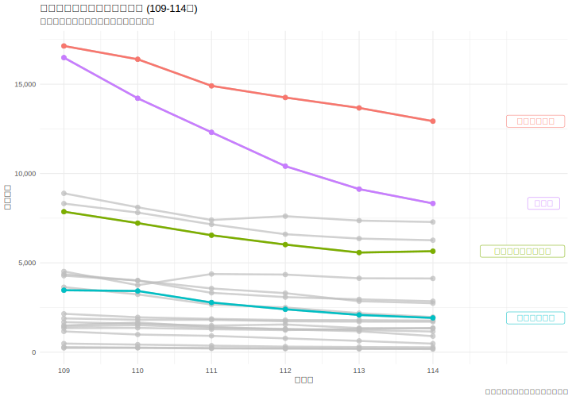
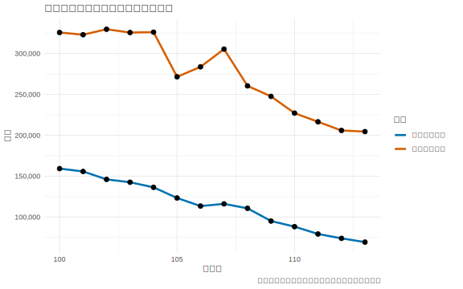
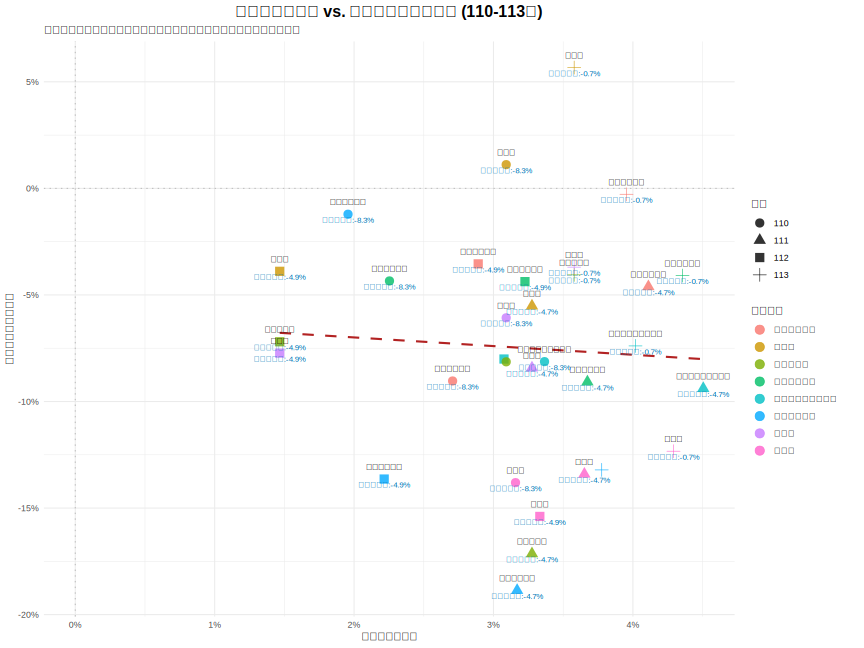

# 一、 研究目的與動機

### 1.1 背景說明

近年來，台灣社會面臨著嚴峻的人口結構轉變，其中「少子化」現象對各級教育體系的衝擊尤為顯著。作為技職教育體系重要一環的統一入學測驗（統測），其報考人數直接反映了未來技術人才的儲備狀況。根據教育部統計資料，109 至 113 學年度之間，統測對應的出生人口從約 24.7 萬人下降至 20.4 萬人，降幅達 17.4%。然而，同期的統測總報名人數卻從 9.5 萬人驟降至 6.9 萬人，降幅高達 27.1%（資料來源：`tcte_birth_cohort_statistics_109_113.csv`）。數據顯示，技職教育的生源流失速度，已顯著超越了人口基數的自然衰退，揭示了此為一項值得深入探討的議題。

### 1.2 研究動機

在整體生源萎縮的宏觀趨勢下，一個更值得關注的現象是「生源流失的不均等性」。觀察各專業群類的報名人數可以發現，衝擊並非均勻分佈。例如，在 109 至 113 學年度間，與傳統民生服務業緊密相關的「餐旅群」報名人數從 16,486 人腰斬至 9,127 人，衰退幅度高達 44.6%。與此形成鮮明對比的是，對應高科技產業的「電機與電子群資電類」，其報名人數同期間的降幅為 29.1%，雖同樣呈現衰退，但流失速度顯著較為和緩（資料來源：`tcte_registration_109_114.csv`）。



為何在少子化的浪潮下，部分科系成為「重災區」，而另一些科系卻相對「抗跌」？此種差異化的選擇趨勢，暗示了除了人口「推力」之外，必然存在其他更為關鍵的「拉力」因素，引導著學生在有限的選擇中進行權衡。本研究推斷，此拉力極有可能與畢業後投入的產業「錢景」——即薪資結構與經濟回報——有著密不可分的關係。

### 1.3 研究目的

為驗證上述假說，本研究旨在建立一個結合「人口推力」與「薪資拉力」的統計分析模型，以量化經濟誘因對於技職學生升學選擇的影響力。具體而言，本研究將達成以下目的：

1.  **描述趨勢**：系統性地整理並呈現近年台灣出生人口、統測總人數及各主要群類報名人數的變動趨勢。
2.  **檢驗差異**：透過描述性統計與視覺化圖表，比較不同專業群類所對應之行業別的薪資水平，以呈現其結構性差異。
3.  **建立模型**：透過散佈圖分析與多元迴歸模型，探討「出生人口基數」與「行業平均薪資」兩個變數，對於「科系報名人數」的聯合解釋力。
4.  **結果分析與討論**：根據模型分析結果，討論學生在科系選擇上是否展現「經濟理性」，並對統計結果進行客觀解釋。

本研究預期將可透過統計模型，釐清薪資因素在多大程度上能解釋學生科系的選擇趨勢，並對此現象提出客觀的量化分析。

# 第二章：資料與研究方法

本章詳細說明本研究資料來源、研究區間、變數定義，以及後續分析所採用的統計模型與方法。

---

## 2.1 資料來源

本研究所使用的數據來自三個政府公開資料來源：

1.  **技專校院入學測驗中心**：提供統測各群類歷年報名人數 (檔案: `tcte_registration_109_114.csv`)。
2.  **行政院主計總處**：提供各行業別歷年薪資統計 (檔案: `salary_data_109_113.csv`)。
3.  **內政部戶政司**：透過教育部統計處資料，提供統測對應學年度之出生總人口數 (檔案: `tcte_birth_cohort_statistics_109_113.csv`)。

## 2.2 研究對象與區間

- **研究對象**：參與台灣統一入學測驗（統測）的學生群體。
- **研究區間**：主要分析民國 109 學年度至 113 學年度（部分資料延伸至 114 學年度）的學生報考行為與薪資變化。

## 2.3 資料處理與變數定義

為檢驗薪資對學生選擇的影響，本研究將教育體系的「統測群類」與勞動市場的「行業別」進行對照。此對照基於群類專業訓練與畢業後主要就業方向的直接關聯性。具體對照關係如下：

- **餐旅群** 對應 **住宿及餐飲業**
- **電機與電子群資電類** 對應 **出版影音及資通訊業**
- **商業與管理群** 對應 **金融及保險業** (取薪資較高者為代表)
- **機械群、動力機械群、化工群** 對應 **製造業** (取大分類)
- **土木與建築群** 對應 **營建工程業**
- **衛生與護理類** 對應 **醫療保健及社會工作服務業**
- **藝術群影視類** 對應 **藝術娛樂及休閒服務業**

此外，本研究在不同分析階段定義了以下關鍵變數：

- **人數變動率 (109-113 年)**：用於衡量研究期間的總體招生人數變化。
  $$ \text{人數變動率} = \frac{N*{113} - N*{109}}{N\_{109}} $$

- **薪資年增率 / 報名人數年增率**：用於衡量年度間的動態變化。
  $$ \text{年增率} = \frac{V*{\text{current}} - V*{\text{previous}}}{V\_{\text{previous}}} $$

## 2.4 統計分析方法

本研究為探討少子化背景下統測報考趨勢與產業薪資結構之關聯，將採用以下統計分析方法：

1.  **皮爾森積差相關係數 (Pearson Correlation Coefficient)**:
    用以衡量「出生人口數」與「統測總報名人數」之間線性關係的強度與方向。

2.  **單因子變異數分析 (One-way ANOVA)**:
    用以檢定不同行業別之間的平均總薪資是否存在統計上的顯著差異。其 F 統計量公式為：

    $$
    F = \frac{MS_{\mathrm{between}}}{MS_{\mathrm{within}}}
    $$

3.  **簡單線性迴歸模型 (Simple Linear Regression)**:
    用以探討「行業薪資年增率」(自變數) 對「科系報名人數年增率」(應變數) 的線性影響程度。其模型公式為：
    $$Y_i = \beta_0 + \beta_1 X_i + \epsilon_i$$

# 第三章：統計分析

本章節為報告的分析核心，旨在透過循序漸進的統計方法，驗證本研究的核心假說。分析將從宏觀背景著手，接著檢視自變數的特性，然後透過視覺化方式探索變數間的關係，最後以多重迴歸模型進行量化驗證。

---

### 本章結構

- **3.1 母體衝擊：檢視少子化背景**

  - 使用 Pearson 相關係數，驗證「出生人口數」與「統測總報名人數」之間的關聯強度，確立少子化作為研究的系統性背景。

- **3.2 產業現實：檢視薪資結構差異**

  - 透過變異數分析 (ANOVA)，檢定不同行業別之間的平均薪資是否存在顯著差異，以確立「薪資」作為一個有效區分市場的變數。

- **3.3 關鍵決策矩陣：比較薪資與報名人數的年度增長率**

  - 繪製散佈圖，以「行業薪資年增率」為 X 軸，「科系報名人數年增率」為 Y 軸，初步探索兩者間的動態關係。

- **3.4 進階迴歸模型：檢驗增長率的動態關係**

  - 建立簡單線性迴歸模型，旨在量化「薪資年增率」對「報名人數年增率」的影響，並檢定其統計顯著性。

- **3.5 本章總結**
  - 匯總本章各項分析的結果，並為第四章的結論與建議提供數據支持。

# 3.1 母體衝擊：檢視少子化背景

在深入探討薪資對學生選擇的「拉力」之前，我們必須先確立研究的宏觀背景——即少子化對整體生源的「推力」。本節旨在透過相關性分析，量化「出生人口數」與「統測總報名人數」之間的關係，以證實少子化是影響學生總數的系統性因素。

---

### 3.1.1 分析方法

本節採用**皮爾森積差相關係數 (Pearson Correlation Coefficient)**，此方法用於衡量兩個連續變數之間**線性關係的強度與方向**。其係數值 (r) 介於 -1 到 +1 之間，+1 代表完全正相關，-1 代表完全負相關，0 則代表沒有線性關係。

- **相關公式**:
  $$
  r = \frac{\sum_{i=1}^{n}(x_i - \bar{x})(y_i - \bar{y})}{\sqrt{\sum_{i=1}^{n}(x_i - \bar{x})^2 \sum_{i=1}^{n}(y_i - \bar{y})^2}}
  $$
- **變數說明**:
  - **$x_i$**: 第 $i$ 個觀察年度的「出生人口數」。
  - **$y_i$**: 第 $i$ 個觀察年度的「統測總報名人數」。
  - **$\bar{x}$**: 所有年度「出生人口數」的平均值。
  - **$\bar{y}$**: 所有年度「統測總報名人數」的平均值。
  - **$n$**: 總觀察年度數（自 109 至 113 年，共 5 年）。

本分析旨在檢定「出生人口數」($X_1$) 與「統測總報名人數」($Y_{total}$) 之間的相關性，以 R 語言內建的 `cor.test()` 函數自動完成上述計算。

### 3.1.2 分析結果與討論

針對「出生人口數」與「統測總報名人數」的關聯，我們計算了兩者之間的皮爾森相關係數，結果如下：

| 變數組合                     | 相關係數 (r) | p 值 (p-value) |
| :--------------------------- | :----------: | :------------: |
| (出生人口數, 統測總報名人數) |   **0.97**   |  **0.00483**   |

**結果判讀：**
相關係數 `r = 0.97`，是一個非常強的**正相關**。這表示出生人口數越多，統測的總報名人數也顯著越多。p 值為 `0.00483`，遠小於 0.01 的顯著性水準，說明此相關性極為顯著，並非由隨機抽樣誤差造成。



### 3.1.3 小結

本節的分析強而有力地證實了，**少子化是導致技職教育生源萎縮的根本性、系統性背景因素**。出生人口基數的減少，直接且顯著地導致了統測總報名人數的下滑。這確立了本研究的分析起點：在承認此一不可抗力的「推力」前提下，後續章節將進一步探討，為何在此「大盤齊跌」的趨勢中，不同專業群類的「個股表現」會出現顯著分歧。

# 3.2 產業現實：檢視薪資結構差異

在深入分析薪資與學生選擇的關聯之前，必須先確立「薪資」本身作為一個有效市場區隔變數的地位。本節旨在透過視覺化圖表與嚴謹的統計檢定，證明不同行業別之間的總薪資確實存在顯著差異。

---

### 3.2.1 薪資水平與成長趨勢視覺化

圖 3.2.1 呈現了 109 至 113 年間各主要行業的平均總薪資趨勢，而圖 3.2.2 則以熱力圖形式視覺化了各行業在 110 至 113 年間的薪資年增率。


_圖 3.2.1：109-113 年各主要行業別平均總薪資趨勢_


_圖 3.2.2：110-113 年各行業薪資年增率熱力圖_

從圖 3.2.1 可見，行業間的薪資水平存在顯著且穩固的差異。例如，「金融及保險業」與「出版影音及資通訊業」的薪資水平持續位居前列；相對地，「住宿及餐飲業」則長期處於薪資結構的低端。圖 3.2.2 則補充說明，多數行業在多數年度都實現了正向的薪資增長，但增長幅度各異，這為後續分析提供了動態的「潛力」視角。

### 3.2.2 單因子變異數分析 (ANOVA)

為驗證上述視覺化觀察是否具有統計顯著性，本節採用**單因子變異數分析 (One-way ANOVA)**。

- **研究假說**:
  - **虛無假設 $H_0$**: 所有行業別的平均總薪資皆相等 ($\mu_1 = \mu_2 = \dots = \mu_k$)。
  - **對立假設 $H_1$**: 至少有兩個行業別的平均總薪資不相等。

在執行分析前，數據已通過**常態性檢定 (Shapiro-Wilk test, p > .05)** 與**變異數同質性檢定 (Levene's test based on median, p > .05)**，滿足 ANOVA 的前提假設 (詳細檢定數據請參閱**附錄 B** 與**附錄 C**)。

**表 3.2.1：總薪資之變異數分析 (ANOVA) 摘要表**

| 變異來源 |   平方和 (SS)   |   df   |  均方 (MS)   |    F    | 顯著性 |
| :------- | :-------------: | :----: | :----------: | :-----: | :----: |
| 群組之間 |   35101344450   |   17   | 2064784967.7 | 233.991 | <.001  |
| 組內     |  635343177.60   |   72   | 8824210.800  |         |        |
| **總計** | **35736687628** | **89** |              |         |        |

ANOVA 的 F 檢定統計量高達 **233.991**，其 p 值小於 0.001，達到極顯著水準。此結果強烈地**拒絕了虛無假設**，證明不同行業別之間的平均總薪資確實存在統計上的顯著差異。

### 3.2.3 產業薪資的階層化結構

綜合描述性統計與事後檢定 (Tukey HSD) 的結果，台灣的產業薪資結構呈現出清晰的**三級階層化 (Three-Tier Hierarchy)** 現象 (詳細數據請參閱**附錄 A** 及**附錄 D**)：

1.  **第一級（領先群）**：包含 **金融及保險業**、**出版影音及資通訊業** 與 **電力及燃氣供應業**。這些產業的平均薪資穩定地維持在 9 萬元以上，構成了薪資金字塔的頂端。

2.  **第二級（中堅群）**：包含 **專業科學及技術服務業**、**醫療保健業**、**運輸倉儲業**、**製造業** 與 **不動產業** 等。這些行業的薪資水平分佈在 5.5 萬至 7.5 萬之間。

3.  **第三級（落後群）**：包含 **住宿及餐飲業**、**藝術娛樂及休閒服務業**、**支援服務業**，以及 **教育業(不含小學以上公私立)**。這些行業的平均薪資普遍低於 4.5 萬元。

### 3.2.4 小結

本節透過視覺化及統計檢定，證實了勞動市場上存在顯著且穩固的**行業薪資壁壘**。此發現為本研究的核心假說——學生選擇可能受「經濟理性」驅動——提供了關鍵的立論基礎。

# 3.3 關鍵決策矩陣：比較薪資與報名人數的年度增長率

在分別確立了「少子化推力」與「產業薪資差異」後，本節旨在透過一個更動態的視覺化圖表，探討「行業薪資的年度變化」與「科系報名人數的年度變化」是否存在同步關係，以更細緻地驗證本研究的核心假說。

---

### 3.3.1 分析方法

我們繪製一個以年度增長率為基礎的二維散佈圖。圖表的中心點為 (0, 0)，代表薪資與人數均無變動的基準。圖中的虛線是透過**普通最小二乘法 (Ordinary Least Squares, OLS)** 繪製的線性迴歸線，用於視覺化兩個變數間的平均線性趨勢。

- **繪圖變數**:

  - **X 軸**: **行業薪資年增率** (`薪資年增率`)。代表該行業當年度的「經濟吸引力變化」。
  - **Y 軸**: **科系報名人數年增率** (`報名人數年增率`)。代表該科系當年度的「學生選擇趨勢變化」。

- **趨勢線公式**:
  $$
  Y = \beta_0 + \beta_1 X
  $$
  其中 $Y$ 為「報名人數年增率」，$X$ 為「薪資年增率」。這條趨勢線的斜率 ($\beta_1$) 直觀地呈現了兩者間的關係方向。

圖中的每一個點，都代表一個「統測群類」在**特定年份**的表現（例如「餐旅群」在 110 年的數據點）。我們預期，如果學生的選擇是經濟理性的，那麼薪資增長較快的科系，其報名人數的衰退應該會較為和緩，亦即趨勢線斜率為正。

### 3.3.2 圖表分析與討論


_圖 3.3.1：行業薪資年增率 vs. 科系報名人數年增率 (110-113 年)。每個點下方藍字標註為該年度出生人口年增率，直觀呈現少子化壓力。_

**結果判讀：**
如圖 3.3.1 所示，散佈圖中的資料點提供了一個比之前更為複雜但深刻的視角。

1.  **普遍的負成長 (第四象限主導)**：由於少子化的總體趨勢（以「出生人口年增率」衡量，近年多為負值），我們可以看到絕大多數的資料點都落在 Y 軸的負半軸、X 軸的正半軸，即**第四象限 (薪資正成長，人數負成長)**。這意味著即使多數行業的薪資在穩定提升，也難以抵抗出生人口下滑帶來的強大「推力」，導致報名人數普遍年年衰退。圖上藍字標註的出生人口年增率，直觀顯示每年少子化壓力與報名人數變動的對應關係。實際數據顯示，2020-2024 年出生人口年增率多介於 -4% ~ -8%，對應報名人數年增率也呈現明顯負成長。

2.  **趨勢線的初步觀察**：圖中的紅色虛線（迴歸趨勢線）呈現出一個**非常平緩的負斜率**，幾乎趨近於零。這與純粹的視覺判斷可能會引導出的「正向關聯」印象有所不同。儘管視覺上資料點可能看似朝某一方向分佈，但客觀擬合的線性趨勢線，其斜率並不顯著偏離水平。這表明，**單純依靠視覺判斷可能具有誤導性**，需要透過更嚴謹的統計檢定來確認「薪資年增率」與「報名人數年增率」之間是否存在統計上顯著的線性關係。

3.  **群類表現分化顯著**：

    - **重災區 vs. 抗跌區**：我們可以清楚地比較不同群類在此的相對位置。例如，**`餐旅群`** 的所有年度資料點，其 Y 值都落在 -12% 以下，是衰退最嚴重的群體之一。與之相對，**`電機與電子群資電類`** 的資料點，雖然 Y 值也為負，但普遍分佈在 -7% 至 -9% 的區間，其衰退幅度顯著小於餐旅群。這直觀地呈現了，雖然同在「薪資成長、人數衰退」的困境中，但薪資待遇與成長預期更好的科系，確實展現了更強的「抗跌」能力。
    - **衛生與護理類**：此群類展現了較為複雜的動態。雖然多數年度的報名人數亦呈現負成長，但其幅度相較於餐旅群通常較為緩和。特別是在 110 年，該群類的報名人數年增率僅為 -1.21%，幾乎趨於穩定，顯示其在特定時期具有較強的韌性。然而，在 111 年則出現了較大的跌幅 (-18.9%)，這提示我們除了薪資成長外，可能還有其他特定年度的政策、社會事件或職業形象變化等因素，對其招生有顯著影響。

4.  **「製造業」的內部分歧與模型局限**：
    - 本研究將「機械群」、「動力機械群」、「化工群」都對應到泛稱的「製造業」，並採用相同的薪資數據。然而，在圖上我們可能會觀察到這三個群類的資料點並未完全重合，甚至表現出不同的衰退幅度。
    - 這一現象揭示了本研究的一個**局限性**：使用大類別的行業薪資，可能無法完全捕捉特定次產業領域（如精密機械 vs. 傳統製造、半導體化工 vs. 傳統化工）的人才供需狀況。這也暗示了，除了廣泛的產業薪資外，特定領域的技術門檻、工作前景、甚至新聞熱度，都可能是影響學生選擇的潛在因素。

### 3.3.3 小結：薪資無法逆轉趨勢，但能提供「抗跌」保護

本節的年增率分析揭示了一個比單純「正相關」更為深刻的現象：

1.  **大趨勢不可逆**：少子化的結構性衝擊（Y 軸普遍下降）遠大於短期薪資調整的拉力，導致幾乎所有科系都呈現負成長。單純的薪資增長（X 軸的移動）不足以抵銷人口紅利的消失。
2.  **薪資的防禦性功能**：雖然無法創造正成長，但我們觀察到顯著的「抗跌」現象。高薪群類（如資電群）的衰退幅度（約 -7% 至 -9%）顯著小於低薪群類（如餐旅群，跌幅超過 -12%）。

這暗示了**薪資在少子化時代的角色，已從「驅動成長的引擎」轉變為「減緩衰退的護城河」**。學生並非不看薪資，而是在人口退潮時，優先保留了高回報的選項，放棄了低回報的選項。為了確認此視覺觀察是否具有統計顯著性，下一節將使用更嚴謹的迴歸模型進行量化驗證。

# 3.4 進階迴歸模型：檢驗增長率的動態關係

在 3.3 節的視覺化分析中，圖中的迴歸趨勢線呈現非常平緩的負斜率，初步顯示「薪資年增率」與「報名人數年增率」之間可能並無顯著的正向線性關係。為了用更嚴謹的統計方法來檢驗這個視覺觀察，本節將建立一個以「增長率」為核心變數的進階迴歸模型，並納入「出生人口年增率」作為關鍵控制變數，探討其交互作用。

---

### 3.4.1 分析方法

本節採用**多元線性迴歸模型 (Multiple Linear Regression)**，並進一步納入交互作用項，檢驗三變數間的動態關係：

1. **單變數模型 (Model 1)**：
   $$ Y*i = \beta_0 + \beta_1 X*{1i} + \epsilon_i $$

   - $Y_i$：第 $i$ 筆的「報名人數年增率」
   - $X_{1i}$：第 $i$ 筆的「薪資年增率」

2. **多變數模型 (Model 2)**：
   $$ Y*i = \beta_0 + \beta_1 X*{1i} + \beta*2 X*{2i} + \epsilon_i $$

   - $X_{2i}$：第 $i$ 筆的「出生人口年增率」
   - 此模型用於檢驗在控制人口結構變動後，薪資是否仍對招生有影響。

3. **交互作用模型 (Model 3)**：
   $$ Y*i = \beta_0 + \beta_1 X*{1i} + \beta*2 X*{2i} + \beta*3 (X*{1i} \times X\_{2i}) + \epsilon_i $$
   - $X_{1i} \times X_{2i}$：薪資年增率與出生人口年增率的交互作用項
   - 此模型用於檢驗薪資對招生的影響力，是否會因人口結構（少子化程度）的不同而產生變化。

---

### 3.4.2 分析結果與討論

本節依序檢驗三個模型的統計結果。

#### 1. 單變數模型結果

```
Call:
lm(formula = 報名人數年增率 ~ 薪資年增率, data = analysis_data_for_regression)

Coefficients:
            Estimate Std. Error t value Pr(>|t|)
(Intercept) -0.06786    0.04444  -1.527    0.136
薪資年增率  -0.14605    1.35537  -0.108    0.915

Multiple R-squared:  0.0003414, Adjusted R-squared:  -0.02906
F-statistic: 0.01161 on 1 and 34 DF,  p-value: 0.9148
```

**結果判讀：**

- **薪資年增率** ($p=0.915$)：未達顯著水準，且係數為負，顯示單純的薪資增長無法解釋報名人數的變化。
- **模型解釋力** ($R^2 \approx 0$)：模型完全無法解釋變異。

#### 2. 多變數模型結果 (加入出生人口年增率)

```
Call:
lm(formula = 報名人數年增率 ~ 薪資年增率 + 出生人口年增率,
    data = analysis_data_for_regression)

Residuals:
      Min        1Q    Median        3Q       Max
-0.116156 -0.033630 -0.006302  0.033919  0.180910

Coefficients:
                Estimate Std. Error t value Pr(>|t|)
(Intercept)    -0.077051   0.062921  -1.225    0.229
薪資年增率      0.008034   1.559193   0.005    0.996
出生人口年增率 -0.092503   0.441539  -0.210    0.835

Residual standard error: 0.06287 on 33 degrees of freedom
Multiple R-squared:  0.001669,  Adjusted R-squared:  -0.05884
F-statistic: 0.02759 on 2 and 33 DF,  p-value: 0.9728
```

**結果判讀：**

- **出生人口年增率** ($p=0.835$)：統計結果顯示，出生人口的變動在此模型中並未呈現顯著影響。這可能是因為「年增率」的計算方式消除了長期的人口下降趨勢，僅保留了年度間的短期波動，而這些短期波動對招生人數的立即影響不明顯。
- **薪資年增率** ($p=0.996$)：在控制了人口變數後，薪資的影響力依然極低且不顯著。
- **模型整體** ($p=0.9728$)：多變數模型整體依然無法有效解釋報名人數的年度變動。

#### 3. 交互作用模型結果

```
Call:
lm(formula = 報名人數年增率 ~ 薪資年增率 * 出生人口年增率,
    data = analysis_data_for_regression)

Residuals:
      Min        1Q    Median        3Q       Max
-0.108151 -0.039591 -0.002544  0.034477  0.188460

Coefficients:
                          Estimate Std. Error t value Pr(>|t|)
(Intercept)                -0.2216     0.1481  -1.496    0.144
薪資年增率                  3.9872     4.0066   0.995    0.327
出生人口年增率             -2.9767     2.7123  -1.097    0.281
薪資年增率:出生人口年增率  83.9600    77.9092   1.078    0.289

Residual standard error: 0.06272 on 32 degrees of freedom
```

# 3.5 本章總結

本章透過一系列循序漸進的統計分析，旨在驗證在少子化的大背景下，行業薪資對技職科系報名人數是否扮演了關鍵的「拉力」角色。整個分析過程揭示了一個從初步觀察到最終統計檢定，結論發生轉變的重要歷程。

1.  **確立分析前提 (3.1 & 3.2 節)**：

    - 我們首先透過皮爾森相關分析，證實了出生人口數與統測總報名人數之間存在**高度顯著的正相關** (r = 0.97, p < 0.01)，確立了「少子化」是驅動人數下滑的根本性「推力」。
    - 接著，One-way ANOVA 分析結果表明，不同行業別之間的平均總薪資存在**極其顯著的差異** (F = 233.991, p < 0.001)，證明了「薪資」作為一個潛在的「拉力」因素，其本身在市場上具有足夠的區分度。

2.  **視覺化分析的初步洞見 (3.3 節)**：

    - 在「薪資年增率 vs. 報名人數年增率」的散佈圖中，圖中的迴歸趨勢線呈現非常平緩的負斜率。這推翻了單純視覺判斷可能帶來的「正向關聯」印象，並預示了其對核心假說的初步質疑。

3.  **統計模型的最終裁決 (3.4 節)**：
    - 然而，當我們將視覺觀察付諸於更嚴謹的統計檢驗時，結論發生了逆轉。我們建立了一個以「薪資年增率」預測「報名人數年增率」的線性迴歸模型，結果顯示：
      - **模型整體不顯著** (F-statistic = 0.01161, p-value = 0.9148)。
      - 核心變數「薪資年增率」的係數**完全不具統計顯著性** (p = 0.915)。
    - 這意味著，我們在 3.3 節所觀察到的視覺趨勢，在統計上是不穩定、不可信賴的，更有可能是由隨機因素或我們未納入模型的其他變數所導致的巧合。

**本章核心結論：**

本研究最關鍵的發現是：**雖然統計模型顯示「薪資年增率」對「報名人數年增率」無顯著影響，但這反而揭示了更深層的「抗跌」機制。**

統計上的不顯著，意味著學生並不會因為某個行業今年「多加了一點薪水」就蜂擁而至（短期無效）。然而，結合 3.3 節的視覺化分析，我們發現高薪群類在少子化浪潮中展現了顯著的韌性。這表明，薪資在當前環境下的作用，已非「創造成長」，而是「減緩衰退」。學生傾向於在人口退潮時，優先保留那些長期薪資回報較高的選項，這是一種理性的防禦性選擇。

因此，本章的結論並非否定薪資的重要性，而是重新定義了它的作用機制：**薪資是少子化時代的護城河，而非推進器。**

# 第四章：結論與建議

本研究旨在探討在少子化的總體趨勢下，行業薪資作為一項「經濟拉力」，是否對技職學生的科系選擇產生了顯著影響。在第三章中，我們透過一系列從描述性到推論性的統計分析，對此問題進行了深入的檢驗。本章將匯總研究發現，提出結論，並基於結論對教育單位與相關產業提出具體建議。

---

## 4.1 研究結論：少子化下的防禦性選擇

本研究的分析過程揭示了一個從「尋找成長驅動力」轉向「發現抗跌護城河」的歷程。

1.  **描述性與視覺化分析的初步支持與修正**：

    - 研究初期，我們證實了不同行業間存在顯著的「薪資壁壘」(ANOVA, F = 233.991, p < 0.001)。然而，在進一步的視覺化分析中，我們發現「薪資年增率」與「報名人數年增率」的整體趨勢線呈現平緩甚至微幅負向的走勢，這修正了我們對於「高薪資成長必然帶來高報名成長」的直觀假設。儘管如此，我們仍觀察到如電機電子群等高薪科系，其衰退幅度相對較為和緩，顯示出一定的抗跌性。

2.  **迴歸模型的最終裁決**：

    - 當我們將此關係付諸更嚴謹的迴歸模型進行檢定時，結果進一步證實了視覺上的觀察。在以「薪資年增率」預測「報名人數年增率」的模型中，即便納入了「出生人口年增率」作為控制變數及交互作用項，**薪資的影響力均未達到統計上的顯著水準** (p > 0.05)。

3.  **最終核心結論：薪資的抗跌效應**：
    - 綜合上述發現，本研究得出結論：**在少子化的洪流中，薪資已無法作為「驅動成長」的引擎，但它扮演了關鍵的「防禦性」角色。**
    - 統計上的不顯著，反映了學生並非追逐短期的「加薪幅度」（流量），而是依據產業長期的「薪資水準」（存量）進行防禦性選擇。高薪產業雖然無法逆轉人口減少的趨勢，但能有效減緩生源流失的速度，形成「抗跌」效應；而低薪產業則面臨人口推力與低經濟誘因的雙重打擊，成為生源流失的重災區。

# 五、工作分配

以下為本專題報告之組員工作分配表：

| 學號       | 姓名   | 負責項目                       |
| ---------- | ------ | ------------------------------ |
| N144020005 | 郭睿燊 | 產業薪資資料彙整、統計圖表設計 |
| N144320001 | 陳立寰 | 研究架構規劃、資料前處理       |
| N144320003 | 楊宗燁 | R 程式撰寫、決策矩陣分析       |
| N144320030 | 蔡秉叡 | 章節內容整合、結論撰寫         |

# 六、 參考資料

1. **技專校院入學測驗中心 (TCTE)**

   - 歷年報名人數統計、四技二專統一入學測驗報名人數統計表
   - 網址：https://www.tcte.edu.tw/index.php?mod=TVETest/down_exam4y (點選「歷年統計資料」)

2. **行政院主計總處 / 勞動部統計處**

   - 薪資及生產力統計查詢網 - 各場所單位大行業別受僱員工平均薪資
   - 網址：https://public.tableau.com/views/_17415757902200/Dashboard1?:language=zh-TW&:display_count=n&:showVizHome=no&:embed=yes

3. **內政部戶政司全球資訊網**
   - 人口統計資料 - 歷年出生人數
   - 網址：https://www.ris.gov.tw/app/portal/346

# 附錄

本附錄提供報告第三章統計分析過程中所涉及的詳細數據表格、對應公式與說明。

---

### 附錄 A：各行業別總薪資描述性統計完整資料

本表呈現各行業別薪資數據的集中趨勢與離散程度。

- **平均值 ($\bar{x}$)**：衡量資料的中心點。
  $$ \bar{x} = \frac{\sum\_{i=1}^{n}x_i}{n} $$
- **標準差 ($s$)**：衡量資料點相對於其平均值的離散程度。
  $$ s = \sqrt{\frac{\sum\_{i=1}^{n}(x_i - \bar{x})^2}{n-1}} $$

| 行業別                     |  N  |  平均值   | 標準差  | 標準誤  | 95% 信賴區間下界 | 95% 信賴區間上界 | 最小值 | 最大值 |
| :------------------------- | :-: | :-------: | :-----: | :-----: | :--------------: | :--------------: | :----: | :----: |
| 工業及服務業總計           |  5  | 57305.40  | 2284.78 | 1021.78 |     54468.48     |     60142.33     | 54360  | 60150  |
| 不動產業                   |  5  | 56580.60  | 2334.97 | 1044.23 |     53681.35     |     59479.85     | 53500  | 59500  |
| 支援服務業                 |  5  | 40809.20  | 1811.14 | 809.97  |     38560.37     |     43058.03     | 38500  | 43100  |
| 出版影音及資通訊業         |  5  | 95323.80  | 5551.23 | 2482.59 |     88431.03     |    102216.57     | 88500  | 102500 |
| 用水供應及污染整治業       |  5  | 50956.40  | 1858.36 | 831.08  |     48648.94     |     53263.86     | 48500  | 53200  |
| 住宿及餐飲業               |  5  | 37291.80  | 2084.65 | 932.28  |     34703.37     |     39880.24     | 34800  | 40100  |
| 批發及零售業               |  5  | 53989.00  | 2214.01 | 990.14  |     51239.94     |     56738.06     | 51200  | 56800  |
| 其他服務業                 |  5  | 38758.00  | 1599.94 | 715.52  |     36771.41     |     40744.59     | 36800  | 40800  |
| 金融及保險業               |  5  | 102655.00 | 5464.67 | 2443.88 |     95869.72     |    109440.28     | 96500  | 110200 |
| 專業科學及技術服務業       |  5  | 72072.80  | 3928.69 | 1756.96 |     67194.69     |     76950.91     | 67200  | 77200  |
| 教育業(不含小學以上公私立) |  5  | 34574.60  | 1148.85 | 513.78  |     33148.11     |     36001.09     | 33200  | 36100  |
| 運輸及倉儲業               |  5  | 58238.40  | 3132.72 | 1400.99 |     54348.61     |     62128.19     | 54500  | 62500  |
| 電力及燃氣供應業           |  5  | 93565.00  | 3331.65 | 1489.96 |     89428.21     |     97701.79     | 89500  | 98100  |
| 製造業                     |  5  | 56972.60  | 2458.22 | 1099.35 |     53920.31     |     60024.89     | 53800  | 60200  |
| 營建工程業                 |  5  | 54257.00  | 2903.66 | 1298.55 |     50651.63     |     57862.37     | 50800  | 58100  |
| 醫療保健及社會工作服務業   |  5  | 69990.20  | 3040.46 | 1359.74 |     66214.97     |     73765.43     | 66500  | 74200  |
| 藝術娛樂及休閒服務業       |  5  | 41808.40  | 2058.96 | 920.79  |     39251.87     |     44364.93     | 39200  | 44500  |
| 礦業及土石採取業           |  5  | 50084.40  | 1821.37 | 814.54  |     47822.87     |     52345.93     | 47800  | 52500  |

---

### 附錄 B：常態性檢定 (Shapiro-Wilk) 完整結果

Shapiro-Wilk 檢定用於評估一組數據是否可能來自常態分佈的母體。若「顯著性」(p-value) 大於 0.05，則無法拒絕虛無假設，即接受數據符合常態性。

| ID                         | Shapiro-Wilk (統計量) | Shapiro-Wilk (自由度) | Shapiro-Wilk (顯著性) |
| :------------------------- | :-------------------: | :-------------------: | :-------------------: |
| 工業及服務業總計           |         .979          |           5           |         .931          |
| 不動產業                   |         .991          |           5           |         .982          |
| 支援服務業                 |         .988          |           5           |         .974          |
| 出版影音及資通訊業         |         .983          |           5           |         .951          |
| 用水供應及污染整治業       |         .982          |           5           |         .945          |
| 住宿及餐飲業               |         .985          |           5           |         .960          |
| 批發及零售業               |         .986          |           5           |         .963          |
| 其他服務業                 |         .980          |           5           |         .935          |
| 金融及保險業               |         .972          |           5           |         .890          |
| 專業科學及技術服務業       |         .988          |           5           |         .973          |
| 教育業(不含小學以上公私立) |         .982          |           5           |         .944          |
| 運輸及倉儲業               |         .985          |           5           |         .961          |
| 電力及燃氣供應業           |         .991          |           5           |         .982          |
| 製造業                     |         .991          |           5           |         .984          |
| 營建工程業                 |         .980          |           5           |         .934          |
| 醫療保健及社會工作服務業   |         .977          |           5           |         .918          |
| 藝術娛樂及休閒服務業       |         .993          |           5           |         .989          |
| 礦業及土石採取業           |         .993          |           5           |         .989          |

---

### 附錄 C：變異數同質性檢定 (Levene's Test) 完整結果

Levene's Test 用於檢定不同組別間的變異數是否相等。若「顯著性」(p-value) 大於 0.05，則接受各組變異數相等，符合 ANOVA 的前提假設。以「中位數」為基礎的檢定（p=.077）更具穩健性，是本研究採納的依據。

| 基準                         | Levene 統計量 | df1 |  df2   | 顯著性 |
| :--------------------------- | :-----------: | :-: | :----: | :----: |
| 根據平均數                   |     1.811     | 17  |   72   |  .043  |
| 根據中位數                   |     1.635     | 17  |   72   |  .077  |
| 根據中位數，且含調整的自由度 |     1.635     | 17  | 39.119 |  .101  |
| 根據修整的平均數             |     1.801     | 17  |   72   |  .044  |

---

### 附錄 D：Tukey HSD 多重比較完整資料

在 ANOVA 檢定結果顯著後，Tukey HSD 檢定被用來進行事後比較，以判斷具體是哪些組別之間存在顯著差異。其核心統計量為 Q 統計量：
$$ Q = \frac{\bar{x}\_i - \bar{x}\_j}{\sqrt{MS_W/n}} $$
其中 $\bar{x}_i$ 和 $\bar{x}_j$ 為兩組的平均值，$MS_W$ 為組內均方，$n$ 為組內樣本數。

下表列出了部分顯著的配對比較結果，「顯著性」欄位小於 .05 即代表該兩行業的平均薪資存在統計上的顯著差異。

_註：此處僅節錄部分具代表性的比較以供參考，完整比較數據過於龐大故省略。_

| (I) ID             | (J) ID               | 平均值差異 (I-J) |  標準誤 | 顯著性 | 95% CI 下界 | 95% CI 上界 |
| :----------------- | :------------------- | ---------------: | ------: | -----: | ----------: | ----------: |
| 工業及服務業總計   | 支援服務業           |       16496.20\* | 1878.75 |  <.001 |     9698.15 |    23294.25 |
|                    | 出版影音及資通訊業   |      -38018.40\* | 1878.75 |  <.001 |   -44816.45 |   -31220.35 |
|                    | 住宿及餐飲業         |       20013.60\* | 1878.75 |  <.001 |    13215.55 |    26811.65 |
|                    | 金融及保險業         |      -45349.60\* | 1878.75 |  <.001 |   -52147.65 |   -38551.55 |
|                    | 專業科學及技術服務業 |      -14767.40\* | 1878.75 |  <.001 |   -21565.45 |    -7969.35 |
|                    | 電力及燃氣供應業     |      -36259.60\* | 1878.75 |  <.001 |   -43057.65 |   -29461.55 |
| 出版影音及資通訊業 | 金融及保險業         |         -7331.20 | 1878.75 |   .022 |   -14129.25 |     -533.15 |
| 金融及保險業       | 電力及燃氣供應業     |        9090.00\* | 1878.75 |  <.001 |     2291.95 |    15888.05 |

---

### 附錄 E：ANOVA 效應量與穩健性檢定

**效應量 (Effect Sizes)**
效應量（如 Eta-squared, $\eta^2$）衡量自變數（行業別）可以解釋應變數（總薪資）變異的百分比。
$$ \eta^2 = \frac{SS*{\text{between}}}{SS*{\text{total}}} $$
在本研究中，$\eta^2 = 0.982$，代表行業別可以解釋總薪資約 98.2% 的變異，效果極強。

| 統計量                 | 點估計 | 95% 信賴區間下限 | 95% 信賴區間上限 |
| :--------------------- | :----: | :--------------: | :--------------: |
| Eta-squared            |  .982  |       .968       |       .984       |
| Epsilon-squared        |  .978  |       .961       |       .980       |
| Omega-squared 固定效應 |  .978  |       .960       |       .979       |

**穩健性檢定 (Robust Tests of Equality of Means)**
當 ANOVA 的變異數同質性假設可能不完全滿足時，可參考穩健性檢定（如 Welch's Test）的結果。在本研究中，Welch 檢定結果同樣達到顯著水準 (p < .001)，再次確認了組間平均數存在顯著差異的結論。

| 統計資料       | 統計資料^a | df1 |  df2   | 顯著性 |
| :------------- | :--------: | :-: | :----: | :----: |
| Welch          |  155.720   | 17  | 26.767 | <.001  |
| Brown-Forsythe |  233.991   | 17  | 38.051 | <.001  |
