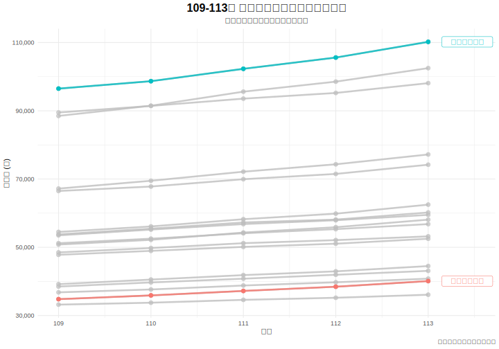
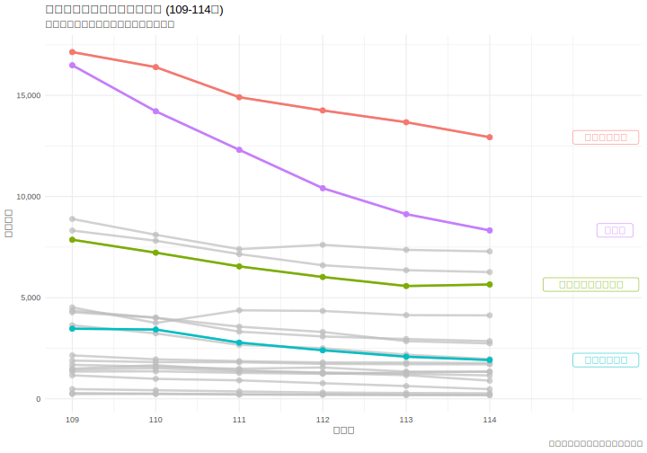
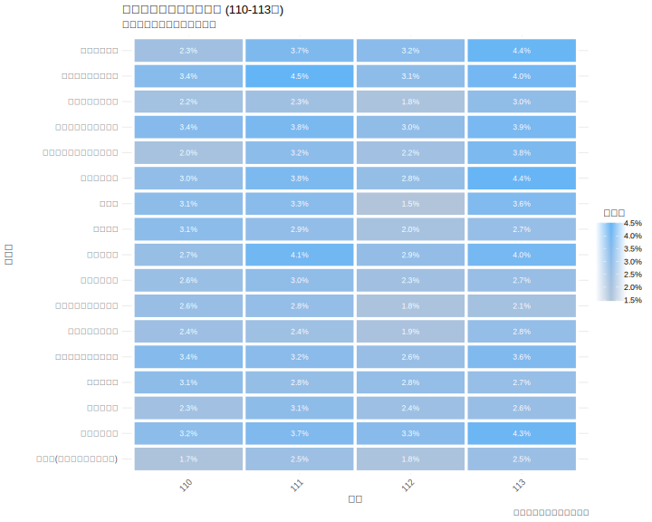

# 第二章：資料與研究方法

本章詳細說明本研究資料來源、研究區間、變數定義，並透過視覺化圖表對資料進行初步的探索性分析。

---

## 2.1 資料來源

本研究所使用的數據來自三個政府公開資料來源：

1.  **技專校院入學測驗中心**：提供統測各群類歷年報名人數 (檔案: `tcte_registration_109_114.csv`)。
2.  **行政院主計總處**：提供各行業別歷年薪資統計 (檔案: `salary_data_109_113.csv`)。
3.  **內政部戶政司**：透過教育部統計處資料，提供統測對應學年度之出生總人口數 (檔案: `tcte_birth_cohort_statistics_109_113.csv`)。

## 2.2 研究對象與區間

- **研究對象**：參與台灣統一入學測驗（統測）的學生群體。
- **研究區間**：主要分析民國 109 學年度至 113 學年度（部分資料延伸至 114 學年度）的學生報考行為與薪資變化。

## 2.3 資料處理與變數定義

為檢驗薪資對學生選擇的影響，本研究將教育體系的「統測群類」與勞動市場的「行業別」進行對照。此對照基於群類專業訓練與畢業後主要就業方向的直接關聯性。具體對照關係如下：

- **餐旅群** 對應 **住宿及餐飲業**
- **電機與電子群資電類** 對應 **出版影音及資通訊業**
- **商業與管理群** 對應 **金融及保險業** (取薪資較高者為代表)
- **機械群、動力機械群、化工群** 對應 **製造業** (取大分類)
- **土木與建築群** 對應 **營建工程業**
- **衛生與護理類** 對應 **醫療保健及社會工作服務業**
- **藝術群影視類** 對應 **藝術娛樂及休閒服務業**

此外，本研究在不同分析階段定義了以下關鍵變數：

- **人數變動率 (109-113 年)**: $(N_{113} - N_{109}) / N_{109}$，用於衡量研究期間的總體招生人數變化。
- **薪資年增率 / 報名人數年增率**: $(V_{current} - V_{previous}) / V_{previous}$，用於衡量年度間的動態變化。

---

## 2.4 描述性統計與視覺化探索

在深入進行假設檢定之前，本節旨在透過一系列的視覺化圖表，對本研究使用的關鍵數據進行初步的探索與描述。

### 2.4.1 歷年產業薪資趨勢

_圖 2-1：109-113 年各主要行業別平均總薪資趨勢_

圖 2-1 呈現了 109 至 113 年間各主要行業的平均總薪資趨勢。從圖中可見，行業間的薪資水平存在顯著且穩固的差異。例如，「金融及保險業」與「出版影音及資通訊業」的薪資水平持續位居前列，並呈現穩健增長；相對地，「住宿及餐飲業」則長期處於薪資結構的低端。

### 2.4.2 歷年科系報名人數趨勢

_圖 2-2：109-114 學年度各科系群類報名人數趨勢變化_

圖 2-2 顯示了各主要科系群類在 109 至 114 學年度的報名人數變化趨勢。儘管整體上因少子化效應，幾乎所有科系都呈現下滑趨勢，但下滑的幅度（斜率）卻大相徑庭。「餐旅群」的報名人數出現了最劇烈的下滑；而「電機與電子群資電類」與「衛生與護理類」雖然也面臨人數減少，但流失速度相對較為和緩。

### 2.4.3 薪資年增率熱力圖

_圖 2-3：110-113 年各行業薪資年增率熱力圖_

圖 2-3 以熱力圖的形式，視覺化了 110 至 113 年間各行業的薪資年增率。藍色代表正增長，紅色代表負增長。從圖中可以觀察到，大多數行業在多數年度都實現了正向的薪資增長，顯示整體經濟的脈動。然而，個別行業在特定年度仍可能出現薪資停滯或微幅負增長的情況，這提供了比單純看薪資水平更細緻的行業景氣變化資訊。

### 2.4.4 歷年出生人口與統測總報名人數趨勢

_圖 2-4：歷年出生人口與統測總報名人數趨勢對比_

圖 2-4 呈現了歷年出生人口數與統測總報名人數的變化趨勢。從圖中可清楚看出，兩者之間存在高度的同步性，統測總報名人數的下降趨勢與對應出生人口的下降趨勢高度一致。這突顯了少子化是影響整體技職教育招生市場的根本性宏觀因素。
