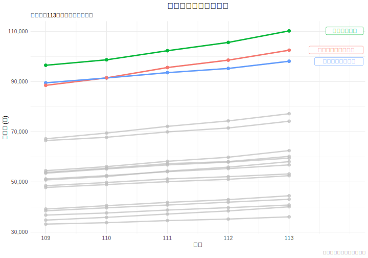
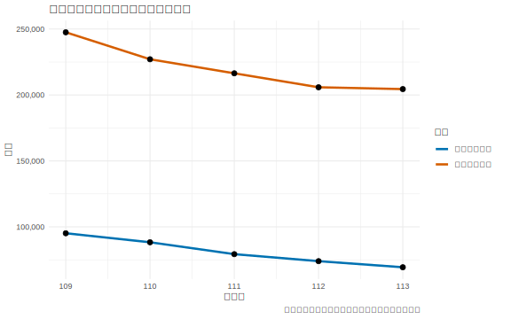
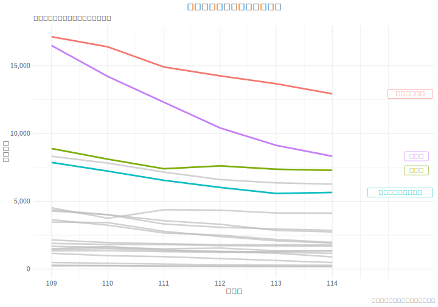

# 3.1 資料總覽與敘述性統計 (Data Overview and Descriptive Statistics)

---

本節旨在對研究中使用的核心資料集進行初步的探索性分析。我們將透過敘述性統計摘要與多種視覺化圖表，呈現資料的分佈特徵、集中趨勢與潛在關聯，為後續的章節提供分析基礎。

### 3.1.1 敘述性統計摘要

*(在此呈現關鍵變數的敘述性統計表。表格應包含樣本數(N)、平均數(Mean)、中位數(Median)、標準差(Std. Dev.)、最小值(Min)與最大值(Max)等指標。)*

- **薪資資料 (salary_data_109_113.csv)**:
  *(呈現各行業薪資的統計數據)*

- **歷年出生人口 (tcte_birth_cohort_statistics_109_113.csv)**:
  *(呈現出生人口數的統計數據)*

- **統測報名人數 (tcte_registration_109_114.csv)**:
  *(呈現各群類報名人數的統計數據)*

### 3.1.2 資料視覺化

*(本節的圖表旨在呈現各個項目（產業別、科系）自身的歷年趨勢，以便進行比較。您可以執行 `scripts/3-1_analysis.R` 來產生以下所有圖表。)*

**1. 各行業薪資趨勢圖**
*(此圖表中的每一條線代表一個行業，呈現其從 109 至 113 年的「總薪資」變化。為了清晰起見，圖中自動突顯並標示出薪資水平較高的行業，其餘行業則以灰色背景線呈現。)*

**2. 出生與報名人數資料：歷年趨勢**
*(此圖呈現了出生總人口與統測總報名人數的五年趨勢，直觀地展示了兩者同步下降的情況。)*

**3. 各科系報名人數趨勢圖**
*(此圖表中的每一條線代表一個科系群類，呈現其從 109 至 114 學年度的「報名人數」變化。為了便於觀察，圖中自動突顯並標示出幾個報名人數較多的重點群類，其餘則以灰色背景線呈現。)*

