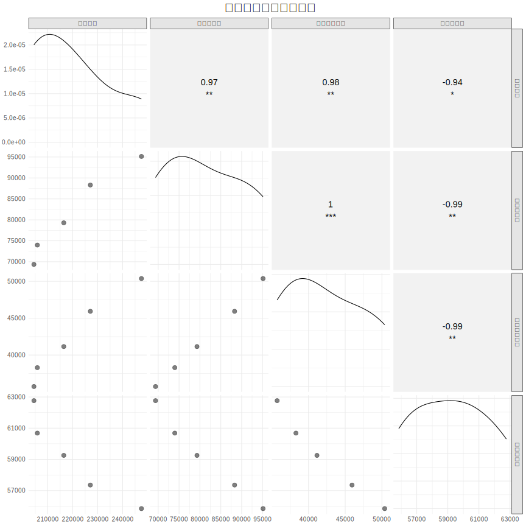

# 3.1 資料總覽與敘述性統計 (Data Overview and Descriptive Statistics)

---

本節旨在對研究中使用的核心資料集進行初步的探索性分析。我們將透過敘述性統計摘要與多種視覺化圖表，呈現資料的分佈特徵、集中趨勢與潛在關聯，為後續的章節提供分析基礎。

### 3.1.1 敘述性統計摘要

_(在此呈現關鍵變數的敘述性統計表。表格應包含樣本數(N)、平均數(Mean)、中位數(Median)、標準差(Std. Dev.)、最小值(Min)與最大值(Max)等指標。)_

- **薪資資料 (salary_data_109_113.csv)**:
  _(呈現各行業薪資的統計數據)_

- **歷年出生人口 (tcte_birth_cohort_statistics_109_113.csv)**:
  _(呈現出生人口數的統計數據)_

- **統測報名人數 (tcte_registration_109_114.csv)**:
  _(呈現各群類報名人數的統計數據)_

### 3.1.2 資料視覺化

_(本節的圖表旨在呈現各個項目（產業別、科系）自身的歷年趨勢，以便進行比較。您可以執行 `scripts/3-1_analysis.R` 來產生以下所有圖表。)_

**1. 各行業薪資趨勢圖**
_(此圖表中的每一條線代表一個行業，呈現其從 109 至 113 年的「總薪資」變化。為了清晰起見，圖中自動突顯並標示出薪資水平較高的行業，其餘行業則以灰色背景線呈現。)_

**2. 出生與報名人數資料：歷年趨勢**
_(此圖呈現了出生總人口與統測總報名人數的五年趨勢，直觀地展示了兩者同步下降的情況。)_

**3. 各科系報名人數趨勢圖**
_(此圖表中的每一條線代表一個科系群類，呈現其從 109 至 114 學年度的「報名人數」變化。為了便於觀察，圖中自動突顯並標示出幾個報名人數較多的重點群類，其餘則以灰色背景線呈現。)_

**4. 各行業薪資年增率熱力圖**
_(此熱力圖呈現了各行業在不同年份的薪資年增率。顏色越藍代表增長率越高，越紅代表增長率越低（甚至負增長）。這有助於快速識別哪些行業在特定年份表現突出或落後。)_

**5. 各科系群類總人數變化長條圖**
_(此長條圖直接比較了各科系群類在 109 學年度與 114 學年度之間的報名總人數變化量，並由小至大排序。這清晰地揭示了在此期間，哪些群類是人數流失的重災區。)_

**6. 各科系群類報名人數佔比堆疊面積圖**
_(此圖呈現了各科系群類報名人數佔當年度總人數的百分比變化。它能顯示出不同群類的「市場份額」消長，例如，儘管所有科系人數都在下降，但某些科系的佔比可能反而是穩定或上升的。)_

**7. 核心變數相關性矩陣圖**
_(此圖表探索了核心變數（出生人數、總報名人數、重點科系人數、平均總薪資）之間的兩兩關係。對角線是各變數自身的密度分佈；右上半部是皮爾森相關係數（星號代表顯著程度）；左下半部是變數之間的散佈圖與趨勢線。這為後續的迴歸分析提供了全面的視覺化基礎。)_

