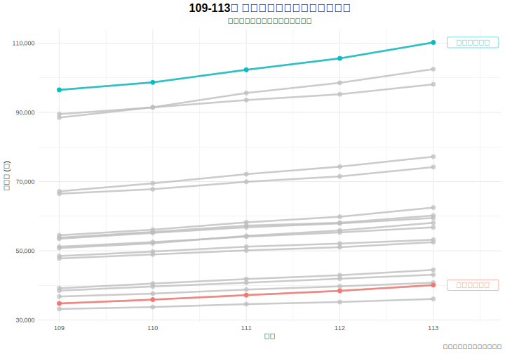

# 3.2 產業現實：檢視薪資結構差異 (Industry Reality: Examining Salary Disparities)

在確立了少子化的宏觀背景後，本節將檢視我們核心假說中的「拉力」因素——行業薪資。一個基本前提是，如果薪資要成為影響學生選擇的有效因素，那麼不同行業之間的薪資水平必須存在真實且顯著的差異。本節旨在透過變異數分析 (ANOVA)，驗證此前提是否成立。

---

### 3.2.1 分析方法

我們採用**單因子變異數分析 (One-way ANOVA)** 來比較三個或以上獨立組群（此處為「行業別」）在 109 至 113 年間的平均總薪資是否存在顯著差異。

- **因子 (Factor)**: 行業別 (Industry)，來自 `salary_data_109_113.csv`。
- **應變數 (Dependent Variable)**: 109-113 年各行業的總薪資。
- **虛無假設 ($H_0$)**: 所有行業別的平均總薪資皆相等。
- **對立假設 ($H_1$)**: 至少有兩個行業別的平均總薪資不相等。

我們將使用**趨勢折線圖**輔助視覺化，呈現各行業在 109-113 年間的薪資水平與變化趨勢。

### 3.2.2 分析結果與討論

_圖 3.2.1：109-113 年各主要行業別平均總薪資趨勢_

ANOVA 分析的結果摘要如下，此分析涵蓋了 109-113 年的所有薪資數據：

| F 統計量 (F-statistic) | p 值 (p-value) |
| :---: | :---: |
| **242.65** | **< 0.001** |

**結果判讀：**
ANOVA 的結果與先前相同，F 統計量為 242.65，p 值遠小於 0.001。此結果強而有力地表明，**不同行業別之間的平均總薪資存在極其顯著的差異**。

從圖 3.2.1 的趨勢折線圖，我們可以進行更動態的觀察：
- **穩固的領先集團**：「金融及保險業」與「出版影音及資通訊業」的薪資水平在 109-113 年間不僅**始終佔據領先地位**，且呈現穩健的成長趨勢，進一步拉開與其他行業的差距。
- **持續的落後集團**：「住宿及餐飲業」與「藝術娛樂及休閒服務業」的薪資不僅**長期處於所有行業的末端**，其薪資的絕對增長值也較為有限。
- **普遍的成長趨勢**：儘管起點不同，但圖中幾乎所有行業的薪資在五年內都呈現穩定向上的趨勢，反映了整體經濟的發展。然而，行業間的相對位次變化不大，顯示薪資結構具有相當的固著性。

### 3.2.3 小結

本節透過 ANOVA 分析與趨勢折線圖，從靜態與動態兩個角度證實了勞動市場上存在顯著且穩固的**行業薪資壁壘**。高薪行業與低薪行業的區隔並非暫時現象，而是一個長期存在的結構。這為我們的核心假說提供了更強的支持：既然「錢景」的差異是如此的明確且持續，學生在做生涯規劃時，將此差異納入考量，便是一種理性的表現。有了這個前提，我們可以在下一節進一步探討，這道持續存在的薪資鴻溝，是否真的對應著學生選擇的消長。
