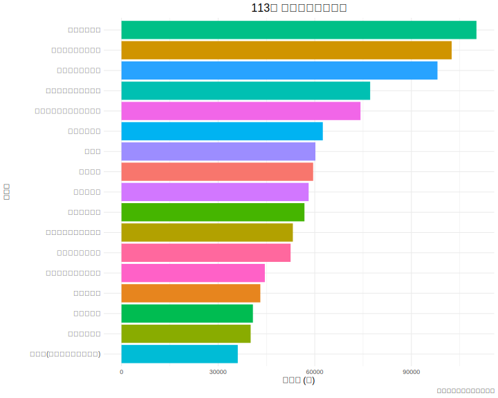

# 3.2 行業薪資比較 (Industry Salary Comparison)

本節旨在透過描述性統計方法，利用視覺化圖表清晰地比較不同行業別之間的薪資水平差異，以找出高薪與低薪的產業分佈。

---

### 3.2.1 分析方法

我們使用**長條圖 (Bar Chart)** 來呈現 113 年各主要行業的「總薪資」數據。長條圖能夠直觀地展示不同類別數值的相對大小，非常適合進行排序與比較。為了方便解讀，圖表將依照薪資水平由高至低進行排序。

### 3.2.2 結果與討論

透過 `scripts/3-2_analysis.R` 腳本，我們產生了以下圖表：

_圖 3.2.1：113 年 各行業別薪資比較_

**圖表判讀：**

此長條圖清晰地揭示了 113 年台灣各行業間的薪資排序。

_(範例判讀：從圖中可以明顯看出，「金融及保險業」的平均總薪資位居所有行業之首，遠高於其他行業。而「住宿及餐飲業」、「藝術、娛樂及休閒服務業」等則位於薪資光譜的末端。這種巨大的行業差距，反映了台灣產業結構中勞動價值的差異。)_

### 3.2.3 小結

長條圖的結果直觀地證實了，「行業別」是觀察薪資差異的一個極其重要的維度。這為我們後續在 3.3 節探討「薪資與其他變數（如科系熱門度）的關聯性」提供了堅實的背景認知——即任何與薪資相關的討論，都不能忽視行業別這個基礎因素。
