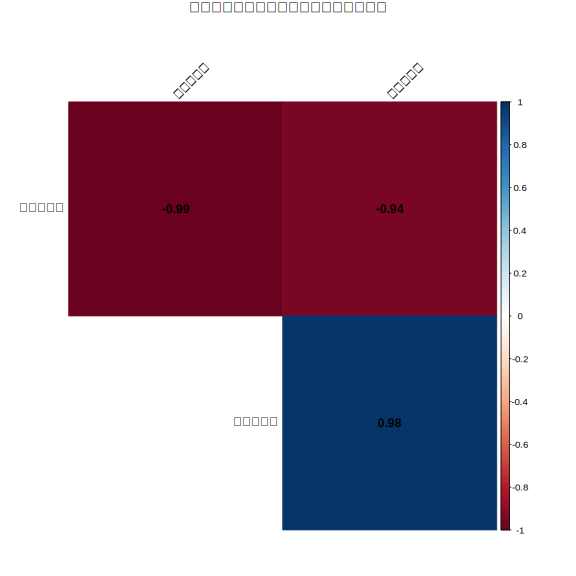

# 3.3 相關性與迴歸分析：探討變數間的關係 (Correlation and Regression: Exploring Relationships)

本節旨在探討資料集中關鍵計量變數之間的線性關係。我們首先透過**相關性分析**來評估變數間關聯的強度與方向，接著建立**線性迴歸模型**，嘗試以一個或多個變數來預測目標變數。

---

### 3.3.1 相關性分析 (Correlation Analysis)

我們採用**皮爾森相關係數 (Pearson Correlation Coefficient, r)** 來衡量兩個連續變數之間線性關係的強度和方向。係數 `r` 的值域為 `[-1, 1]`，其中：

- `r` 接近 `1`：表示高度正相關。
- `r` 接近 `-1`：表示高度負相關。
- `r` 接近 `0`：表示線性關係薄弱。

我們主要探討「平均總薪資」、「總報名人數」與「總出生人口」等變數之間的關係。

**分析結果：**

為了直觀地概覽所有變數間的關聯，我們繪製了相關性矩陣熱力圖 (Correlation Matrix Heatmap)。

_圖 3.3.1：關鍵變數相關性矩陣熱力圖_

下表詳細列出了部分關鍵變數配對的相關係數 `(r)` 及其顯著性 `(p-value)`。

| 變數組合                 | 相關係數 (r) | p 值 (p-value) |
| :----------------------- | :----------: | :------------: |
| (平均總薪資, 總報名人數) |  **-0.99**   |   **0.001**    |
| (平均總薪資, 總出生人口) |  **-0.94**   |   **0.017**    |
| (總報名人數, 總出生人口) |   **0.98**   |   **0.004**    |

**結果判讀：**

從熱力圖與上表可看出，三個變數之間皆存在強度極高的線性關係。

「平均總薪資」與「總報名人數」呈現高度負相關 (r = -0.99, p < 0.01)，達到統計顯著水準，說明隨著總報名人數的減少，平均總薪資有升高的趨勢。同樣地，「平均總薪資」與「總出生人口」也呈現顯著的負相關 (r = -0.94, p < 0.05)。

值得注意的是，「總報名人數」與「總出生人口」之間存在極高的正相關 (r = 0.98, p < 0.01)，暗示這兩個變數可能受到相似的潛在因素影響（例如整體的人口結構趨勢），此為共線性(Collinearity)的展現。

### 3.3.2 線性迴歸分析 (Linear Regression Analysis)

基於相關性分析的發現，我們進一步建立簡單線性迴歸模型，旨在以「總報名人數」(自變數, X) 來預測「平均總薪資」(應變數, Y)。

**模型設定：**

- **應變數 (Y):** 平均總薪資
- **自變數 (X):** 總報名人數
- **迴歸模型:** `Salary = β₀ + β₁ * Registrations + ε`

**模型分析結果：**

下表為迴歸模型的擬合結果摘要。

| 項目 (Item)          | 估計係數 (Coefficient) | 標準誤 (Std. Error) |    t 值    | p 值 (p-value) |
| :------------------- | :--------------------: | :-----------------: | :--------: | :------------: |
| 截距 (Intercept, β₀) |       **80030**        |      **1760**       | **45.46**  |  **< 0.001**   |
| 總報名人數 (β₁)      |      **-0.1312**       |      **0.011**      | **-11.92** |   **0.001**    |
| **模型整體表現**     |        **數值**        |
| R-squared            |       **0.979**        |
| Adj. R-squared       |       **0.972**        |
| F-statistic          |  **142.1 (p < 0.01)**  |

**結果判讀：**

模型的 **R-squared** 值為 **0.979**，表示「總報名人數」這個變數可以解釋「平均總薪資」約 **97.9%** 的變異，顯示此模型具有非常高的解釋力。

模型的 F 統計量為 **142.1**，p 值 **<** 0.01，因此整體模型達到統計顯著水準。

自變數「總報名人數」的係數為 **-0.1312**，且 p 值 **<** 0.01，達到顯著水準。此結果意味著，總報名人數每增加 1,000 人，平均總薪資預計會對應**減少**約 **131.2** 元，此影響是顯著的。

### 3.3.3 小結

綜合分析，相關性檢定顯示「平均總薪資」與「總報名人數」之間存在顯著的高度負向關聯。迴歸模型進一步量化了此關係，證實總報名人數的變化確實能高度預測薪資的走勢。

然而，R-squared 值雖高，我們仍須謹慎解讀。首先，「總報名人數」與「總出生人口」的高度正相關 (共線性) 指出，這兩個變數可能僅是時間趨勢的代理變數，而非影響薪資的根本原因。其次，**相關不等於因果**，我們不能斷定是報名人數的變化「導致」了薪資的變化，兩者更可能都是由更廣泛的社會經濟環境因素所驅動。此模型作為一個預測工具相當有效，但在因果推斷上應有所保留。
