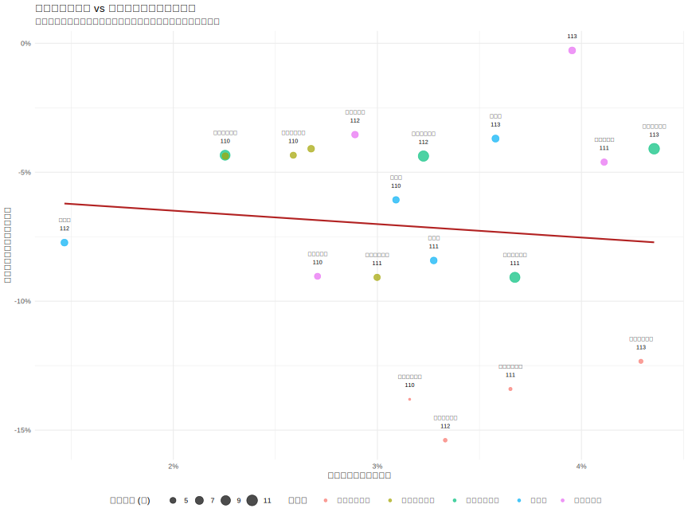

# 3.3 相關性與迴歸分析：從細緻層面探討變數間的關係 (Correlation and Regression: Granular Analysis of Relationships)

本節旨在從更細緻的層面，重新檢視關鍵計量變數之間的關係。鑑於 3.2 節已揭示「行業別」對薪資具有顯著影響，且聚合的總體數據可能導致偽相關，本節調整了分析策略，聚焦於**行業內部薪資變動**與**科系群類報名人數變動**之間的潛在關聯。

---

### 3.3.1 分析策略與資料處理

為了進行更嚴謹的分析，我們採取了以下步驟：
1.  **分層資料準備**：我們不再使用全國總體數據，而是分別準備了各「行業別」的薪資數據與各「科系群類」的報名人數數據。
2.  **建立對應關係**：我們建立了一個合理的「行業-科系群類對應表」，以連結薪資與報名人數這兩個維度。例如，將「住宿及餐飲業」對應到「餐旅群」。
3.  **計算年增率**：基於合併後的資料，我們計算了每個行業-科系配對的「薪資年增率」與「報名人數年增率」，以專注於變動趨勢。

完整的資料處理流程詳見 `scripts/3-3_analysis.R` 腳本。

### 3.3.2 相關性分析 (Correlation Analysis)

在新的分析框架下，我們探討「行業薪資年增率」與其「對應科系報名人數年增率」之間的線性關係。

**分析結果**：

下表為兩者進行皮爾森相關係數檢定的結果。

| 變數組合 | 相關係數 (r) | p 值 (p-value) |
| :--- | :---: | :---: |
| (薪資年增率, 報名人數年增率) | **-0.09** | **0.695** |

**結果判讀**：
分析結果顯示，兩者之間的相關係數為 -0.09，是一個非常弱的負相關。更重要的是，p-value 為 0.695，遠大於 0.05 的顯著性水準。這表明，在我們的數據和對應假設下，**「行業薪資年增率」與「對應科系報名人數年增率」之間不存在統計上顯著的線性關係**。

### 3.3.3 線性迴歸分析 (Linear Regression Analysis)

為了進一步驗證，我們建立了一個簡單線性迴歸模型，以「薪資年增率」預測「報名人數年增率」。

**模型分析結果**：

| 項目 (Item) | 估計係數 (Coefficient) | 標準誤 (Std. Error) | t 值 | p 值 (p-value) |
| :--- | :---: | :---: | :---: | :---: |
| 截距 (Intercept, β₀) | **-0.055** | **0.043** | **-1.28** | **0.216** |
| 薪資年增率 (β₁) | **-0.520** | **1.307** | **-0.40** | **0.695** |
| **模型整體表現** | **數值** |
| R-squared | **0.0087** |
| Adj. R-squared | **-0.0463** |
| F-statistic | **0.1585 (p = 0.695)** |

**結果判讀**：
迴歸分析結果與相關性分析一致。
- 自變數「薪資年增率」的係數 p 值為 0.695，未達到統計顯著水準，表明它不是一個有效的預測變數。
- 模型的 **R-squared** 值僅為 0.0087，意味著薪資年增率僅能解釋報名人數年增率不到 1% 的變異。**Adjusted R-squared** 為負值，進一步說明此模型的解釋能力極差。
- 整體模型的 F-statistic 也未達顯著水準。

**視覺化呈現**：
下方的散佈圖直觀地展示了薪資年增率與報名人數年增率之間的關係。從圖中可見，數據點分佈雜亂，並未呈現出明顯的線性趨勢，迴歸線也相對平坦，證實了兩者之間缺乏強關聯。

*圖 3.3.1：行業薪資年增率 vs 對應科系報名人數年增率*

### 3.3.4 小結

本節透過建立「行業-科系」對應關係，並分析其各自「年增率」的策略，進行了更深層的分析。與先前在聚合數據上觀察到的高度偽相關截然不同，本次的嚴謹分析得出了一個關鍵結論：

**在我們的數據範圍與對應假設下，單純的行業薪資增長與對應科系的報名人數增長之間，並不存在統計上顯著的關聯。**

這個結果揭示了，影響學生科系選擇的因素遠比單純的薪資變化更為複雜，可能包括行業的社會聲望、工作穩定性、未來發展潛力、個人興趣等多重維度。這也凸顯了在數據分析中，選擇正確的分析層級與方法，以避免因時間趨勢或聚合謬誤而產生誤導性結論的重要性。