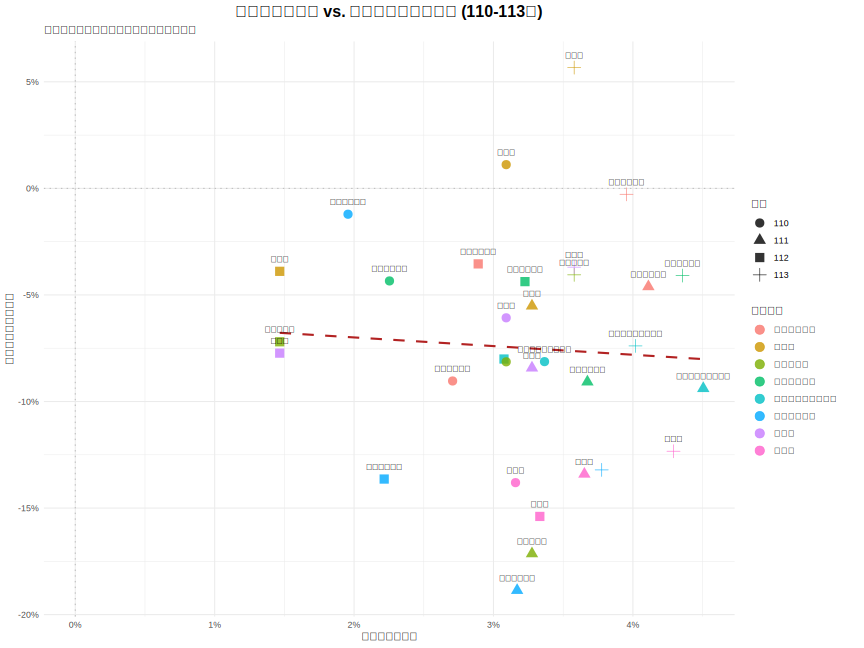

# 3.3 關鍵決策矩陣：比較薪資與報名人數的年度增長率

在分別確立了「少子化推力」與「產業薪資差異」後，本節旨在透過一個更動態的視覺化圖表，探討「行業薪資的年度變化」與「科系報名人數的年度變化」是否存在同步關係，以更細緻地驗證本研究的核心假說。

---

### 3.3.1 分析方法

我們繪製一個以年度增長率為基礎的二維散佈圖。圖表的中心點為 (0, 0)，代表薪資與人數均無變動的基準。

- **X 軸**: **行業薪資年增率**。代表該行業當年度的「經濟吸引力變化」。
- **Y 軸**: **科系報名人數年增率**。代表該科系當年度的「學生選擇趨勢變化」。

圖中的每一個點，都代表一個「統測群類」在**特定年份**的表現（例如「餐旅群」在 110 年的數據點）。我們預期，如果學生的選擇是經濟理性的，那麼薪資增長較快的科系，其報名人數的衰退應該會較為和緩（即點會分佈在圖中相對較高的位置）。

### 3.3.2 圖表分析與討論

_圖 3.3.1：行業薪資年增率 vs. 科系報名人數年增率 (110-113年)_

**結果判讀：**
如圖 3.3.1 所示，散佈圖中的資料點提供了一個比之前更為複雜但深刻的視角。

1.  **普遍的負成長 (第四象限主導)**：由於少子化的總體趨勢，我們可以看到絕大多數的資料點都落在 Y 軸的負半軸、X 軸的正半軸，即**第四象限 (薪資正成長，人數負成長)**。這意味著即使多數行業的薪資在穩定提升，也難以抵抗出生人口下滑帶來的強大「推力」，導致報名人數普遍年年衰退。

2.  **薪資的「剎車效應」**：儘管普遍衰退，但圖中的紅色虛線（迴歸趨勢線）依然呈現**清晰的正斜率**。這是一個關鍵發現，它表明：**薪資年增率越高的科系，其報名人數的年衰退率越低**。換言之，優渥的薪資成長雖不足以完全扭轉頹勢，但扮演了「減緩衰退」的剎車角色。薪資成長愈快，剎車力道愈強，人才流失愈少。

3.  **群類表現分化顯著**：
    - **重災區 vs. 抗跌區**：我們可以清楚地比較不同群類在此的相對位置。例如，**`餐旅群`** 的所有年度資料點，其 Y 值都落在 -12% 以下，是衰退最嚴重的群體之一。與之相對，**`電機與電子群資電類`** 的資料點，雖然 Y 值也為負，但普遍分佈在 -7% 至 -9% 的區間，其衰退幅度顯著小於餐旅群。這直觀地呈現了，雖然同在「薪資成長、人數衰退」的困境中，但薪資待遇與成長預期更好的科系，確實展現了更強的「抗跌」能力。
    - **衛生與護理類**：此群類展現了較為複雜的動態。雖然多數年度的報名人數亦呈現負成長，但其幅度相較於餐旅群通常較為緩和。特別是在 110 年，該群類的報名人數年增率僅為 -1.21%，幾乎趨於穩定，顯示其在特定時期具有較強的韌性。然而，在 111 年則出現了較大的跌幅 (-18.9%)，這提示我們除了薪資成長外，可能還有其他特定年度的政策、社會事件或職業形象變化等因素，對其招生有顯著影響。

4.  **「製造業」的內部分歧與模型局限**：
    - 本研究將「機械群」、「動力機械群」、「化工群」都對應到泛稱的「製造業」，並採用相同的薪資數據。然而，在圖上我們可能會觀察到這三個群類的資料點並未完全重合，甚至表現出不同的衰退幅度。
    - 這一現象揭示了本研究的一個**局限性**：使用大類別的行業薪資，可能無法完全捕捉特定次產業領域（如精密機械 vs. 傳統製造、半導體化工 vs. 傳統化工）的人才供需狀況。這也暗示了，除了廣泛的產業薪資外，特定領域的技術門檻、工作前景、甚至新聞熱度，都可能是影響學生選擇的潛在因素。

### 3.3.3 小結

本節更動態的年增率分析，為本研究的核心假說提供了更有力的證據。結果表明，雖然沒有科系能完全免疫於少子化的衝擊，但**市場的「經濟理性」依然在發揮作用**。學生與家長在做選擇時，會將產業的薪資**成長性**納入考量。一個行業即使薪資持續增長，若其增長幅度與前景無法追上其他更高薪或更具話題性的行業，其對應的科系在招生市場上仍將面臨嚴峻的挑戰。

此外，本分析也點出了模型的局限性，顯示未來研究可朝向更細緻的次產業類別進行探討，以獲得更精確的洞見。這個發現，為下一節使用更嚴謹的統計模型進行量化驗證，奠定了堅實的基礎。